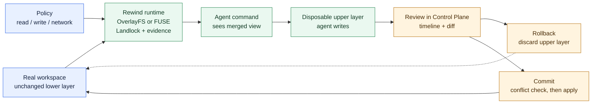

# RewindBPF

RewindBPF is a safety boundary for AI agents that can change files. It starts
the agent in a disposable filesystem transaction, applies read/write policy,
records the run, and lets a person review, roll back, or commit the result.

The enforcement implementation is Linux-first. The full Linux path runs in an
isolated Ubuntu VM. macOS also has a local native transaction path, so the
product demo can be recorded on a Mac without UTM. That Mac demo proves the
local supervisor, UI, read policy, staged writes, diff, rollback, and commit
flow; it does not prove Linux eBPF or OverlayFS enforcement. Windows currently
has a fail-closed platform contract.

## Why this exists

An agent can remove a source directory, overwrite a configuration file, or try
to read a secret before anyone notices. A list of blocked shell commands is
easy to bypass, and copying an entire project before every run is expensive.

Rewind changes the boundary instead. The original workspace is kept as a lower
layer. The agent sees a merged view, but its writes go to a disposable upper
layer. A review can then end in one of two explicit outcomes:



Sensitive reads are controlled separately with user-defined patterns. For
example, a policy can deny `**/*.env`, `**/*.pem`, or a project-specific PII
path without treating `.env` as a special hard-coded file.

## What is implemented

- OverlayFS/FUSE copy-on-write workspace isolation
- Landlock read enforcement for configured paths and patterns
- eBPF filesystem telemetry on the Linux reference path
- cgroup-v2 process scoping and policy-backed network backends
- ordered lifecycle records, manifests, diffs, and evidence checks
- rollback, crash recovery, and conflict-checked commit
- a local supervisor and Control Plane UI for runs, policy, events, and diffs
- benchmark scripts for throughput, latency, storage, telemetry, and lifecycle

This is a CLI, supervisor, and UI. It is not an MCP server or an agent SDK
plugin. The agent command is still the operator's command; Rewind supplies the
execution boundary around it.

## Current platform status

| Platform | Use it for | Boundary |
| --- | --- | --- |
| Ubuntu 24.04 VM | Reference enforcement and jury demo | Privileged OverlayFS/eBPF tests are VM-only |
| macOS | Safe native staged transaction and local UI | Native helper and EndpointSecurity gates are not claimed as complete |
| Windows | Cross-build and fail-closed contract | Signed minifilter/VHDX enforcement is not complete |

The detailed status is in [`docs/PLATFORM_STATUS.md`](docs/PLATFORM_STATUS.md).

## Quick start on macOS

Use a disposable workspace. This is the simplest end-to-end demo on a Mac. It
starts a loopback-only supervisor, opens the Control Plane, and launches a
protected shell:

```bash
go run ./cmd/rewind dashboard start --workspace "$PWD"
```

When the shell exits, inspect the diff in the UI and choose **Rollback** or
**Commit**. A terminal started outside this shell is not retroactively covered.

For a safe demo fixture:

```bash
ROOT="$(mktemp -d /Users/Shared/rewind-demo.XXXXXX)"
mkdir -p "$ROOT/workspace/src"
printf 'original-source\n' > "$ROOT/workspace/src/marker.txt"
printf 'synthetic-secret=do-not-read\n' > "$ROOT/workspace/.env"
go run ./cmd/rewind dashboard start --workspace "$ROOT/workspace"
```

Inside the protected shell, run a deliberately destructive command:

```bash
rm -rf src
printf 'created-by-agent\n' > generated.txt
cat .env
```

The expected result is that `src/` disappears only from the staged view,
`.env` is denied, and `generated.txt` appears as a candidate. Use the UI to
review the timeline and diff, then roll back. The original marker should still
be present in the workspace and `generated.txt` should be gone.

The host checks use temporary fixtures and do not mount a real project:

```bash
make mac-safe-smoke
make mac-native-smoke
make mac-crash-smoke
```

## Linux reference demo

Do this inside the disposable Ubuntu UTM VM, not on a personal host:

```bash
cd /home/vagrant/RewindBPF
REWIND_DEMO_CONFIRM=VM_ONLY make jury-demo-vm
```

The expected success marker is:

```text
JURY_DEMO_VM_PASS
```

The longer acceptance run is:

```bash
REWIND_VM_CONFIRM=VM_ONLY make final-vm
```

The complete recording plan is in
[`docs/HACKATHON_TEST_AND_DEMO_PLAN.md`](docs/HACKATHON_TEST_AND_DEMO_PLAN.md).

## Policy example

Policies are ordinary YAML files. Patterns are user-defined; `.env` is just one
common example.

```yaml
read:
  mode: enforce
  pii:
    mode: audit
  deny:
    - "**/*.env"
    - "**/*.pem"
    - "**/*.key"
    - "/home/*/.ssh/**"
  allow:
    - "/workspace/.env.example"

write:
  mode: rollback
  scope: workspace

network:
  mode: audit

resources:
  pids_max: "256"
  memory_max: "536870912"
  cpu_max: "50000 100000"
```

See [`policies/example.yaml`](policies/example.yaml) for the complete
non-secret example.

## CLI lifecycle

Inside the Linux VM, a protected run looks like this:

```bash
rewind run \
  --workspace ./project \
  --runtime-root ./runtime \
  --policy ./policy.yaml \
  --record ./runtime/record.json \
  --overlay-backend fuse \
  --on-success review \
  -- agent-command

rewind status   --record ./runtime/record.json
rewind diff     --record ./runtime/record.json
rewind events   --record ./runtime/record.json
rewind rollback --record ./runtime/record.json

# Only after reviewing the candidate:
rewind commit --record ./runtime/record.json --confirm
```

`review` keeps the transaction available. Rollback discards it. Commit checks
that the destination has not changed since the run; if it has, Rewind refuses
to overwrite it. External database writes, cloud calls, devices, and other
side effects outside the protected filesystem are not reversible.

## Control Plane and public site

The local UI is in [`ui/`](ui/). It shows run history, timeline/events,
filesystem diffs, policy and workspace settings, evidence state, and lifecycle
actions. Connected mode talks to the local authenticated supervisor. Fixture
mode is non-mutating.

```bash
python3 -m http.server 4174 --directory ui
open http://127.0.0.1:4174
```

The dependency-free jury site is in [`site/`](site/):

```bash
python3 -m http.server 4173 --directory site
open http://127.0.0.1:4173
```

### Screenshots for the project page

The Mac demo is the clearest way to show the product. Capture these from the
connected UI using only the synthetic fixture above; do not include real paths,
secrets, or personal workspace names:

- [ ] `docs/screenshots/dashboard-review.png` — run overview with **Review** state
- [ ] `docs/screenshots/timeline-policy-deny.png` — timeline showing the denied `.env` read
- [ ] `docs/screenshots/diff-rollback.png` — staged deletion and generated file before rollback
- [ ] `docs/screenshots/rollback-complete.png` — rollback result with the original marker restored
- [ ] `docs/screenshots/commit-conflict.png` — optional conflict refusal screen
- [ ] `docs/screenshots/policy-settings.png` — optional user-defined read/write policy

Add the strongest three or four images to the Devpost gallery. The README does
not require screenshots to run the project; they are presentation evidence for
the UI and demo flow.

## Checks and benchmarks

Run these on a normal development machine:

```bash
go test ./...
go vet ./...
make ui-smoke
make site-smoke
make benchmark-verify
make public-audit
```

`make hackathon-preflight` runs the non-privileged checklist and creates a
local evidence bundle. It does not mount filesystems, load eBPF, change
firewall state, or touch a real workspace.

The benchmark ledger compares native and protected B0/B2/B4/B5 scenarios. It
reports measured throughput, latency, storage amplification, lifecycle time,
and telemetry bytes. We do not describe the result as “zero overhead.” Start
with [`benchmarks/RESULTS.md`](benchmarks/RESULTS.md).

## Repository guide

- [`docs/ARCHITECTURE.md`](docs/ARCHITECTURE.md) — implementation boundaries
- [`docs/FEATURE_BACKLOG.md`](docs/FEATURE_BACKLOG.md) — current feature status
- [`docs/PLATFORM_STATUS.md`](docs/PLATFORM_STATUS.md) — platform claims
- [`docs/DEVPOST_SUBMISSION.md`](docs/DEVPOST_SUBMISSION.md) — submission copy
- [`docs/HACKATHON_TEST_AND_DEMO_PLAN.md`](docs/HACKATHON_TEST_AND_DEMO_PLAN.md) —
  judge setup and recording plan
- [`benchmarks/COMPETITOR_MATRIX.md`](benchmarks/COMPETITOR_MATRIX.md) —
  comparison with adjacent tools

## Codex and GPT-5.6

This project was built and iterated in Codex with GPT-5.6 as a build-time
implementation and review partner. Codex helped break the runtime into small
modules, implement and debug the lifecycle, test failure paths, build the UI
and site, and prepare the benchmark and VM gates. The shipped runtime does not
depend on a specific model and can protect any command launched through the
same boundary.

Primary Devpost `/feedback` Session ID:
`019f6f87-53d3-7c11-be4d-6d07217d62ea`

## Safety note

Do not run privileged or destructive tests on a personal Mac or a real
project. Use the disposable Ubuntu VM for OverlayFS, eBPF, cgroup, Landlock,
and network namespace acceptance. Use temporary `/Users/Shared` fixtures for
macOS smoke tests. Never bind-mount a home directory, credential, SSH key, or
customer data.

Before publishing changes, run:

```bash
make public-audit
git diff --check
```

Security reporting guidance is in [`SECURITY.md`](SECURITY.md).
