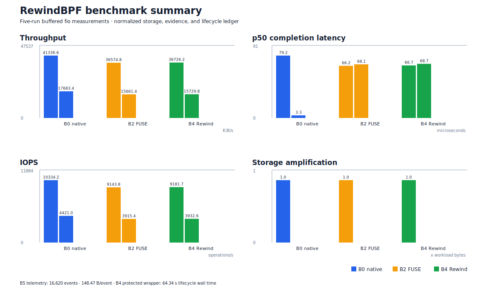

# Benchmark results

**Status:** Living result ledger

These values are the measurements captured in the disposable Ubuntu 24.04 ARM64 VM. The machine was running kernel `6.8.0-49-generic`, fio `3.36`, and buffered I/O (`direct=0`). Raw fio JSON files remain in the VM's temporary benchmark directories; `results_summary.csv` is the source ledger and `results_normalized.csv` is the derived presentation ledger.

## Current results

| Variant | Read IOPS | Write IOPS | Read BW | Write BW | Read p50 | Write p50 | Upper bytes | Storage amp. | Lifecycle | Evidence bytes/event | Notes |
|---|---:|---:|---:|---:|---:|---:|---:|---:|---:|---:|---|
| B0 native ext4 | 10,334.2 | 4,421.0 | 41,336.6 KiB/s | 17,683.4 KiB/s | 79.2 µs | 3.344 µs | 134,217,728 | 1.0000× | — | — | Five repetitions |
| B2 FUSE-only | 9,143.8 | 3,915.4 | 36,574.8 KiB/s | 15,661.4 KiB/s | 66.2 µs | 68.096 µs | 134,217,728 | 1.0000× | — | — | Five repetitions |
| B4 Rewind protected | 9,181.7 | 3,932.6 | 36,726.2 KiB/s | 15,729.8 KiB/s | 66.7 µs | 68.710 µs | 134,253,346 | 1.0003× | 64.34 s* | — | Five repetitions in one protected run |
| B5 telemetry-only | — | — | — | — | — | — | 0 | — | — | 148.47 B | 16,620 events / 2,467,528 telemetry bytes |

\* B4 lifecycle time is the wall time for the five-job protected wrapper, not a single syscall overhead measurement. A separate cold protected control averaged 17.6 s per fresh run because it includes mount, helper, and first-copy-up work.

B4 throughput was approximately 11.1% below B0 and 0.4% above B2. The current result is warm/page-cache exploratory data, not the final cold-cache claim.

## Cold-cache control

Three repetitions with `sync; echo 3 > /proc/sys/vm/drop_caches` before each run produced 43,674 KiB/s read and 18,691 KiB/s write for B0, versus 39,107 KiB/s read and 16,731 KiB/s write for B2. FUSE throughput was approximately 10.5% lower in the cold-cache control, consistent with the warm-cache result. The small three-run sample has higher variance and is reported as a control rather than a production performance guarantee.

Three separate cold B4 protected runs measured 25,606 KiB/s read and 10,931 KiB/s write, with a mean wall time of 17.6 seconds per run. This was 34.5% below cold B2 because each B4 repetition created a fresh protected upper layer and included mount/helper/first-copy-up work, while the B2 control reused one mounted upper layer. It is therefore reported as lifecycle and first-copy-up cost, not as a steady-state hot-path overhead comparison.

## Telemetry result

The direct-fio PID validation generated 16,620 events in a 2,467,528-byte JSONL log: 16,403 `write`, 216 `openat`, and one `unlinkat`. A follow-up shell-to-`dd` smoke generated 46 events across two PIDs (15 `write`, 30 `openat`, and one `execve`), confirming descendant tracking. The Phase 2 sensor-gate smoke generated 77 events (14,428 bytes) with `dropped=0`; a destructive synthetic smoke generated 39 events (7,334 bytes) with `dropped=0`. Each new event record carries a sequence number and userspace hash-chain link; the run record also stores a final SHA-256 over the JSONL stream. A VM-only reduced-ring stress run generated 49,996 persisted events from 50,000 writes, `dropped=37`, `complete=false`, and a non-zero `verify` exit after rollback; this validates loss visibility rather than performance. A background-child test failed closed at the cgroup drain gate and rolled back cleanly. Cgroup-v2 is now the primary run scope; PID tracking remains the event-correlation fallback.

The static footprint was 5,670,919 bytes for the `rewind` binary and 21,352 bytes for the compiled eBPF object. The run record was 746 bytes. The telemetry stream averaged 148.47 bytes per event for this JSONL format. The normalized ledger also records each variant's read/write gap versus B0; B2 is 11.52%/11.44% lower, while B4 is 11.15%/11.05% lower in this warm sample.

## Storage interpretation

For the full-file 128 MiB fio workload, native and FUSE upper storage were both 134,217,728 bytes, so measured copy-up amplification was approximately 1.0x. The B4 upper layer was 134,253,346 bytes because it also contained five small fio JSON outputs and metadata.

The CSV is intentionally separate from `benchmarks/results/`, which remains ignored for large raw artifacts. A future benchmark run should append a new dated row or replace this ledger only after preserving the previous commit. The release/VM gate runs the normalizer and chart generator before acceptance so the displayed evidence cannot drift from the source ledger.
