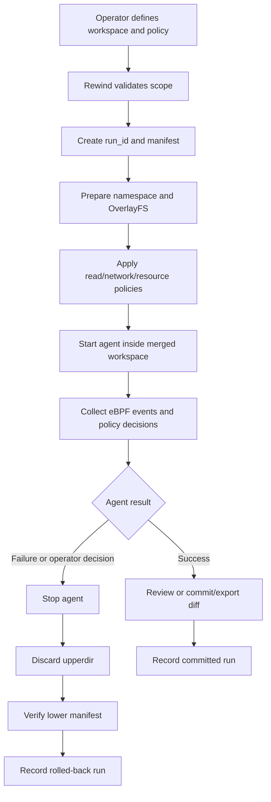
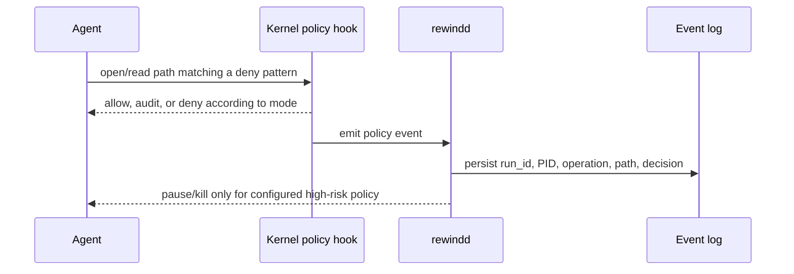
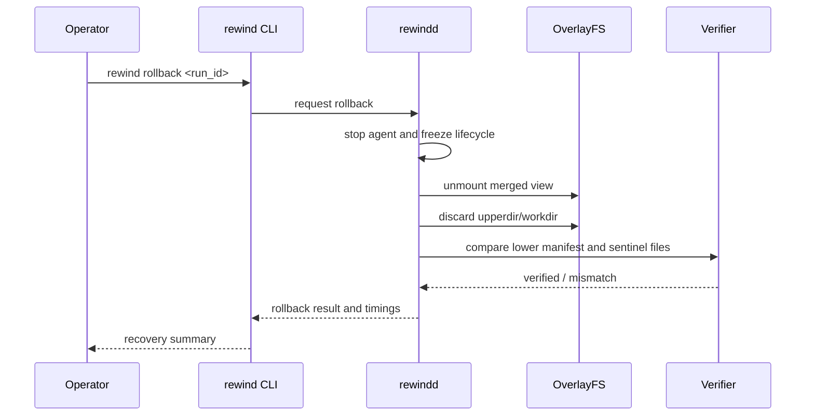
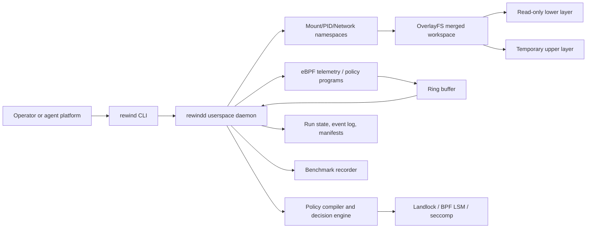
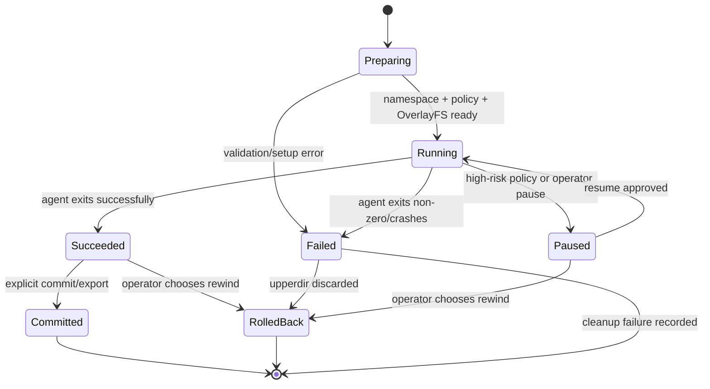

# RewindBPF — Technical Architecture and Business Flows

**Document status:** Living document

**Current stage:** Stage 1 — safe fixtures, manifests, and policy contract

**Last verified:** 2026-07-18
**Source of truth:** This document describes the current product behavior, target architecture, business flows, safety boundaries, and implementation status. It must be updated whenever an implementation stage is completed.

## 1. Product and business purpose

RewindBPF is an AI Agent Safety Runtime. It gives an AI agent a controlled execution transaction instead of direct, unrestricted access to a host filesystem.

The business problem is operational risk: an agent can make a destructive or confidential operation that a human did not anticipate. Traditional backup-before-every-operation approaches add too much I/O and latency. RewindBPF creates the protection boundary before the agent starts, then uses Linux filesystem and kernel capabilities to keep the hot path small.

The product promise is:

> Let an agent work normally inside a controlled transaction; observe its behavior; prevent unauthorized access; and rewind the transaction when the result is unsafe.

The product is not an AI agent. It does not plan tasks or generate code. It protects another agent.

## 2. Business actors and outcomes

| Actor | Need | RewindBPF outcome |
|---|---|---|
| Agent operator | Run an agent without risking the project or host | Starts a scoped transaction and can rewind it |
| Security owner | Define what agents may read or access | Provides path patterns and enforcement modes |
| Developer | Inspect what the agent actually did | Receives an event timeline and run status |
| Platform owner | Measure protection cost | Gets reproducible baseline and overhead reports |
| Judge/demo audience | See a credible failure and recovery | Watches deletion, denial, and one-command rollback |

## 3. Business flows

### 3.1 Safe agent run



### 3.2 Sensitive-read policy flow



### 3.3 Rollback flow



## 4. High-level architecture



### 4.1 Core components

#### `rewind` CLI

The user-facing command surface:

```text
rewind run --workspace PATH --policy POLICY -- COMMAND
rewind status [RUN_ID]
rewind events RUN_ID
rewind rollback RUN_ID
rewind commit RUN_ID
rewind policy check POLICY
```

#### `rewindd` daemon

The control plane. It owns run lifecycle, namespace setup, OverlayFS lifecycle, agent process management, policy loading, eBPF event consumption, manifests, and rollback verification.

The daemon is expected to run with narrowly scoped Linux capabilities inside the disposable lab. The agent itself should run unprivileged inside the sandbox.

#### eBPF programs

The kernel data plane observes target process/cgroup activity and emits compact events through a ring buffer. It does not create snapshots after the fact. Candidate observation points include `execve`, `openat/openat2`, `unlinkat`, `renameat2`, `write`, `pwrite`, `truncate`, and `ftruncate`.

For enforcement, use the appropriate hook and mechanism (BPF LSM, Landlock, seccomp, cgroup BPF). Tracepoints alone are telemetry, not a complete deny mechanism.

#### OverlayFS transaction

`lowerdir` contains the original fixture or rootfs. `upperdir` receives copy-up changes and whiteouts. `workdir` is required by OverlayFS and must satisfy the kernel filesystem requirements. The agent sees only `merged`.

#### Policy engine

User-facing glob patterns are compiled into filesystem access rules. The first read policy supports:

- `off`: do not enforce or audit reads.
- `audit`: allow but emit an event.
- `enforce`: deny and emit an event.

The engine must not perform expensive path regex matching in the kernel hot path.

## 5. Run lifecycle and state machine



Every run has a stable `run_id`, lifecycle status, policy revision, lower manifest, event stream, and timing record.

## 6. Policy model

Example user policy:

```yaml
read:
  mode: enforce
  deny:
    - "**/.env"
    - "**/*.pem"
    - "**/*.key"
    - "/home/*/.ssh/**"
    - "/data/pii/**"
  allow:
    - "/workspace/.env.example"

write:
  mode: rollback
  scope: workspace

network:
  mode: audit
```

Policy design rules:

1. `.env` is an example, not a hardcoded product rule.
2. Users can turn each policy family off, audit it, or enforce it.
3. Deny/allow precedence must be deterministic and documented.
4. `policy check` must show the paths affected before a run starts.
5. Real secrets and personal data must never be used in the test fixtures.

## 7. Isolation and safety boundary

### 7.1 Personal macOS host

The host is development-only. We must not run OverlayFS, eBPF, privileged container, destructive filesystem, or host-wide bind-mount experiments directly on it.

### 7.2 Docker on macOS

Docker Desktop runs Linux containers inside a managed Linux VM. It is useful for Go userspace tests, fixtures, and tooling. A privileged container is not the default kernel lab because it complicates capabilities, nested mount behavior, and the safety boundary.

Recommended layout:

```text
macOS host
  └── disposable Ubuntu VM
        ├── optional Docker for userspace tooling
        └── direct OverlayFS/eBPF integration tests
```

Never bind-mount the real project or personal home directory into a destructive test. Copy synthetic fixtures into the VM or container instead.

### 7.3 Full filesystem mode

System scope is supported only as a disposable VM/rootfs experiment. “Full host protection” means normal filesystem paths inside that disposable Linux environment; it does not claim reversible kernel, device, network, or firmware state.

## 8. Data and observability

Example event:

```json
{
  "run_id": "run_42",
  "pid": 1842,
  "operation": "unlinkat",
  "path": "/workspace/src/main.go",
  "timestamp_ns": 123456789,
  "decision": "allow",
  "risk": "high"
}
```

Persist:

- run lifecycle and policy revision
- lower-layer hash/metadata manifest
- eBPF event stream and dropped-event count
- policy decisions
- OverlayFS upperdir size
- visible recovery and full cleanup durations
- benchmark environment metadata

## 9. Verification invariants

The primary invariant is:

> After rollback, the lower layer is unchanged and sentinel files outside the protected scope are unchanged.

Additional invariants:

- A run cannot start if its isolation prerequisites are not satisfied.
- A daemon failure cannot silently turn a protected run into an unprotected run.
- A policy must be validated before the agent starts.
- A rollback result must include verification, not just an exit code.
- Event loss must be observable and reported.

## 10. Benchmark and test architecture

Benchmark groups:

| Group | Filesystem | eBPF | Daemon | Purpose |
|---|---|---:|---:|---|
| B0 | Native ext4 | No | No | Pure baseline |
| B1 | Native ext4 | Yes | No | eBPF-only cost |
| B2 | OverlayFS | No | No | OverlayFS cost |
| B3 | OverlayFS | Yes | No | eBPF + OverlayFS |
| B4 | OverlayFS | Yes | Yes | Product path |
| B5 | OverlayFS | Yes | Yes + policy | Enforcement cost |

Correctness tests use synthetic fixtures and compare manifests before/after rollback. Destructive tests are allowed only in a disposable VM or an explicitly created test image after a safety review.

## 11. Implementation status

| Stage | Status | Evidence |
|---|---|---|
| Bootstrap repository | Complete | Initial Go module, CLI, Makefile, policy example |
| English project documentation | Complete | README, plan, architecture, benchmark, eBPF, test docs |
| Stage 0 environment inventory | Complete | macOS arm64; Go 1.24.3; Docker Desktop client 27.4.0; Docker context `desktop-linux` |
| Stage 1 fixtures/policy contract | Complete | Synthetic fixture generator, SHA-256 manifest, glob policy parser, run IDs, CLI smoke checks |
| Stage 2 disposable Linux lab | Blocked on explicit environment decision | No VM provisioning performed |
| Stage 3 OverlayFS rollback | Not started | Safety gate required |
| Stage 4 eBPF telemetry | Not started | Safety gate required |
| Stage 5 read policy | Not started | Safety gate required |
| Stage 6 system scope | Not started | Disposable VM only |
| Stage 7 benchmarks | Not started | Baseline first |

## 12. Change protocol

After each implementation stage:

1. Run only the tests authorized for that stage.
2. Record the result and environment in this document.
3. Update the business flow or sequence diagram if behavior changed.
4. Update the end-user instructions in `README.md`.
5. Commit the implementation and documentation together.

Before any risky test, stop and present:

- exact command(s)
- exact VM/container/path scope
- required privileges
- expected side effects
- rollback/recovery path
- whether the test can touch the personal host

No destructive test is implicit permission to touch the personal computer.

## 13. Current Stage 1 implementation

Stage 1 is intentionally host-safe and kernel-free:

- `internal/fixture` creates synthetic workspace, fake secret, and fake PII files.
- `internal/manifest` records portable file structure, mode, size, symlink target, and SHA-256 content hashes.
- `internal/policy` parses YAML, validates `off/audit/enforce`, supports recursive `**` globs, and evaluates allow-over-deny decisions.
- `internal/runid` creates unique run identifiers for later lifecycle state.
- The CLI supports `fixture create`, `manifest create`, `manifest verify`, and `policy check`.

Verified Stage 1 commands:

```bash
go test ./...
go vet ./...
make build
rewind policy check policies/example.yaml
```

The CLI smoke test uses a randomly created temporary directory containing only synthetic data. It does not load eBPF, mount filesystems, use privileged containers, or touch the personal project tree.
