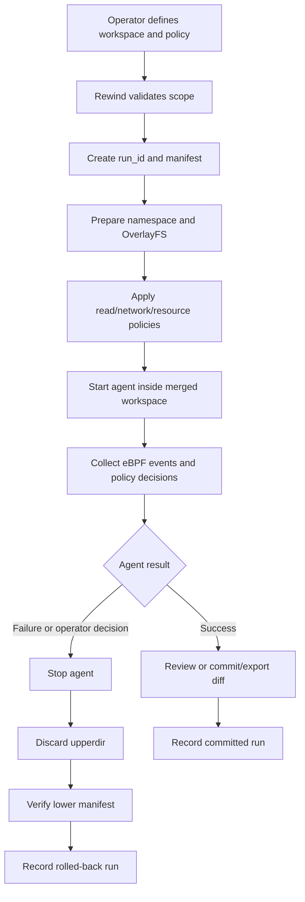
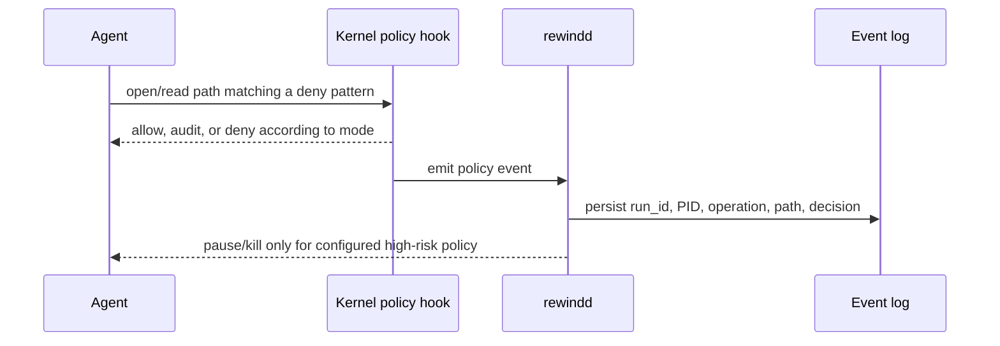
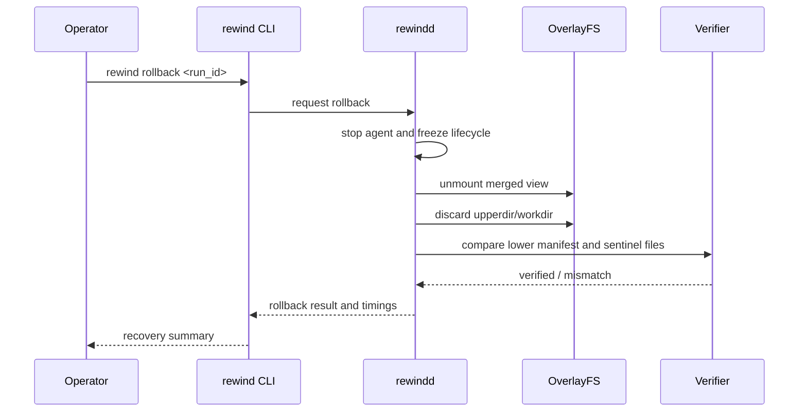
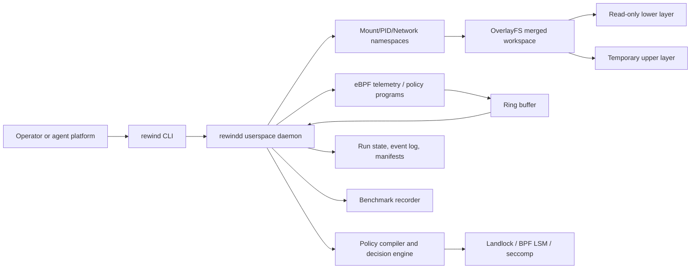
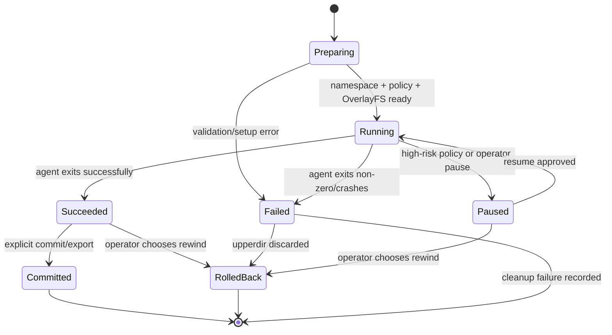

# RewindBPF — Technical Architecture and Business Flows

**Document status:** Living document

**Current stage:** MVP complete — Phase 2 hardening planned

**Last verified:** 2026-07-18
**Source of truth:** This document describes the current product behavior, target architecture, business flows, safety boundaries, and implementation status. It must be updated whenever an implementation stage is completed.

## 1. Product and business purpose

RewindBPF is an AI Agent Safety Runtime. It gives an AI agent a controlled execution transaction instead of direct, unrestricted access to a host filesystem.

The business problem is operational risk: an agent can make a destructive or confidential operation that a human did not anticipate. Traditional backup-before-every-operation approaches add too much I/O and latency. RewindBPF creates the protection boundary before the agent starts, then uses Linux filesystem and kernel capabilities to keep the hot path small.

The product promise is:

> Let an agent work normally inside a controlled transaction; observe its behavior; prevent unauthorized access; and rewind the transaction when the result is unsafe.

The product is not an AI agent. It does not plan tasks or generate code. It protects another agent.

## 2. Business actors and outcomes

| Actor | Need | RewindBPF outcome |
|---|---|---|
| Agent operator | Run an agent without risking the project or host | Starts a scoped transaction and can rewind it |
| Security owner | Define what agents may read or access | Provides path patterns and enforcement modes |
| Developer | Inspect what the agent actually did | Receives an event timeline and run status |
| Platform owner | Measure protection cost | Gets reproducible baseline and overhead reports |
| Judge/demo audience | See a credible failure and recovery | Watches deletion, denial, and one-command rollback |

## 3. Business flows

### 3.1 Safe agent run



### 3.2 Sensitive-read policy flow



### 3.3 Rollback flow



## 4. High-level architecture



### 4.1 Core components

#### `rewind` CLI

The user-facing command surface:

```text
rewind run --workspace PATH --policy POLICY -- COMMAND
rewind status [RUN_ID]
rewind events RUN_ID
rewind rollback RUN_ID
rewind commit RUN_ID
rewind policy check POLICY
```

#### `rewindd` daemon

The control plane. It owns run lifecycle, namespace setup, OverlayFS lifecycle, agent process management, policy loading, eBPF event consumption, manifests, and rollback verification.

The daemon is expected to run with narrowly scoped Linux capabilities inside the disposable lab. The agent itself should run unprivileged inside the sandbox.

#### eBPF programs

The kernel data plane observes target process/cgroup activity and emits compact events through a ring buffer. It does not create snapshots after the fact. Candidate observation points include `execve`, `openat/openat2`, `unlinkat`, `renameat2`, `write`, `pwrite`, `truncate`, and `ftruncate`.

For enforcement, use the appropriate hook and mechanism (BPF LSM, Landlock, seccomp, cgroup BPF). Tracepoints alone are telemetry, not a complete deny mechanism.

#### OverlayFS transaction

`lowerdir` contains the original fixture or rootfs. `upperdir` receives copy-up changes and whiteouts. `workdir` is required by OverlayFS and must satisfy the kernel filesystem requirements. The agent sees only `merged`.

#### Policy engine

User-facing glob patterns are compiled into filesystem access rules. The first read policy supports:

- `off`: do not enforce or audit reads.
- `audit`: allow but emit an event.
- `enforce`: deny and emit an event.

The engine must not perform expensive path regex matching in the kernel hot path.

## 5. Run lifecycle and state machine



Every run has a stable `run_id`, lifecycle status, policy revision, lower manifest, event stream, and timing record.

## 6. Policy model

Example user policy:

```yaml
read:
  mode: enforce
  deny:
    - "**/.env"
    - "**/*.pem"
    - "**/*.key"
    - "/home/*/.ssh/**"
    - "/data/pii/**"
  allow:
    - "/workspace/.env.example"

write:
  mode: rollback
  scope: workspace

network:
  mode: audit
```

Policy design rules:

1. `.env` is an example, not a hardcoded product rule.
2. Users can turn each policy family off, audit it, or enforce it.
3. Deny/allow precedence must be deterministic and documented.
4. `policy check` must show the paths affected before a run starts.
5. Real secrets and personal data must never be used in the test fixtures.

## 7. Isolation and safety boundary

### 7.1 Personal macOS host

The host is development-only. We must not run OverlayFS, eBPF, destructive filesystem, or host-wide bind-mount experiments directly on it.

### 7.2 Direct Ubuntu VM

The kernel MVP runs directly inside an Ubuntu VM managed by UTM on the macOS host. This keeps the Linux kernel, capabilities, mounts, and safety boundary explicit.

Recommended layout:

```text
macOS host
  └── disposable Ubuntu VM
        └── direct RewindBPF OverlayFS/eBPF integration tests
```

Never bind-mount the real project or personal home directory into a destructive test. Copy synthetic fixtures into the VM instead.

### 7.3 Full filesystem mode

System scope is supported only as a disposable VM/rootfs experiment. “Full host protection” means normal filesystem paths inside that disposable Linux environment; it does not claim reversible kernel, device, network, or firmware state.

## 8. Data and observability

Example event:

```json
{
  "run_id": "run_42",
  "pid": 1842,
  "operation": "unlinkat",
  "path": "/workspace/src/main.go",
  "timestamp_ns": 123456789,
  "decision": "allow",
  "risk": "high"
}
```

Persist:

- run lifecycle and policy revision
- lower-layer hash/metadata manifest
- eBPF event stream and dropped-event count
- policy decisions
- OverlayFS upperdir size
- visible recovery and full cleanup durations
- benchmark environment metadata

## 9. Verification invariants

The primary invariant is:

> After rollback, the lower layer is unchanged and sentinel files outside the protected scope are unchanged.

Additional invariants:

- A run cannot start if its isolation prerequisites are not satisfied.
- A daemon failure cannot silently turn a protected run into an unprotected run.
- A policy must be validated before the agent starts.
- A rollback result must include verification, not just an exit code.
- Event loss must be observable and reported.

Storage is measured alongside latency and throughput. For every protected workload, capture static binary/object size, empty-run metadata size, upper/work bytes, telemetry and record-log growth, and `upperdir_physical_bytes / logical_changed_bytes`. This makes copy-on-write amplification visible instead of implying that low hot-path overhead also means low peak disk usage.

## 10. Benchmark and test architecture

Benchmark groups:

| Group | Filesystem | eBPF | Daemon | Purpose |
|---|---|---:|---:|---|
| B0 | Native ext4 | No | No | Pure baseline |
| B1 | Native ext4 | Yes | No | eBPF-only cost |
| B2 | OverlayFS | No | No | OverlayFS cost |
| B3 | OverlayFS | Yes | No | eBPF + OverlayFS |
| B4 | OverlayFS | Yes | Yes | Product path |
| B5 | OverlayFS | Yes | Yes + policy | Enforcement cost |

Correctness tests use synthetic fixtures and compare manifests before/after rollback. Destructive tests are allowed only in a disposable VM or an explicitly created test image after a safety review.

## 11. Implementation status

| Stage | Status | Evidence |
|---|---|---|
| Bootstrap repository | Complete | Initial Go module, CLI, Makefile, policy example |
| English project documentation | Complete | README, plan, architecture, benchmark, eBPF, test docs |
| Stage 0 environment inventory | Complete | macOS arm64; Go 1.24.3 |
| Stage 1 fixtures/policy contract | Complete | Synthetic fixture generator, SHA-256 manifest, glob policy parser, run IDs, CLI smoke checks |
| Stage 2 disposable Linux lab | Complete | UTM Ubuntu 24.04.1 ARM64 VM; kernel 6.8.0-49; direct toolchain and capability audit verified |
| Stage 3 OverlayFS rollback | Complete for isolated MVP boundary; protected-run integration next | Manual VM smoke and opt-in Go mount/rollback test passed against a temporary fixture; lower layer remained unchanged after rollback |
| Stage 4 eBPF telemetry | Complete; read-policy integration next | Object compiled and attached in the disposable VM; JSON events observed for `openat` and `write`; Go components unit-tested |
| Stage 5 read policy | Complete for isolated MVP boundary; lifecycle integration next | Exact-path compiler, Landlock plan, and fixed-key ABI unit-tested; VM-only child-process test passed with allowed read and synthetic secret denied (`EACCES`); optional read-enforcer object remains available for kernels with active `bpf` |
| Stage 6 protected-run integration | Complete | FUSE-backed end-to-end VM smoke passed: read denial, agent deletion isolation, generated-file creation, eBPF telemetry, successful record, rollback, and lower-layer preservation |
| Stage 7 benchmarks | Complete for MVP evidence | Warm/cold B0/B2/B4 results, storage footprint, telemetry growth, and charts are recorded in `benchmarks/RESULTS.md`; broader B1–B5 coverage is Phase 2 work |

### Initial B0 baseline (disposable VM)

The first native-ext4 baseline was captured on 2026-07-18 in the disposable VM with fio 3.36 on Ubuntu 24.04 ARM64 (`6.8.0-49-generic`). Five measured repetitions used one 128 MiB file, 4 KiB random I/O, 70% reads / 30% writes, `iodepth=1`, buffered I/O, a 2-second ramp, and a 10-second measurement window per repetition.

| Metric | Read | Write |
|---|---:|---:|
| Throughput (mean) | 41,337 KiB/s | 17,683 KiB/s |
| IOPS (mean) | 10,334.2 | 4,421.0 |
| p50 completion latency (mean) | 79.2 µs | 3.344 µs |
| p95 completion latency (mean) | 136.5 µs | 7.654 µs |
| p99 completion latency (mean) | 180.8 µs | 14.784 µs |

This is the B0 reference only; it is not evidence for the “near-zero overhead” claim. Throughput standard deviation was approximately 2.7% for both read and write. The next controlled measurement is B2 (FUSE OverlayFS without eBPF or the Rewind lifecycle), followed by B4 (the full protected-run path).

### Exploratory B2 FUSE-only result

The same fio workload was then run five times on a separate FUSE OverlayFS tree (`/home/vagrant/rewind-bench-b2.*`) without eBPF, Landlock, or the Rewind lifecycle. Mean read throughput was 36,575 KiB/s / 9,143.8 IOPS and mean write throughput was 15,661 KiB/s / 3,915.4 IOPS. Relative to B0, throughput was approximately 11.5% lower. Write p50 completion latency was 68.1 µs versus 3.344 µs for B0, exposing the FUSE write-path cost.

The B2 workload left a 134,217,728-byte file in `upper`, matching the 134,217,728-byte native B0 file; measured copy-up amplification for this full-file workload was therefore approximately 1.0x. These are warm/page-cache exploratory results (`direct=0`), not the final overhead claim. Final reporting should include cold-cache and alternating-order repetitions.

### B4 protected-run result and telemetry scope

The full protected path was measured with five fio repetitions inside one Rewind run. Mean read throughput was 36,726 KiB/s / 9,181.7 IOPS and mean write throughput was 15,730 KiB/s / 3,932.6 IOPS. This was approximately 11.1% below B0 and 0.4% above B2, indicating that the steady-state I/O cost was dominated by FUSE rather than the userspace lifecycle/eBPF path. The complete run took 64.34 seconds wall-clock for five 10-second workloads plus ramp/setup. The upper layer was 134,253,346 bytes; the difference from B2 was approximately 35.6 KiB of fio JSON outputs and metadata, not another copy of the 128 MiB data file.

The direct-PID telemetry validation ran fio without a shell wrapper and recorded 16,620 events (16,403 `write`, 216 `openat`, and 1 `unlinkat`) in a 2,467,528-byte JSONL log before rollback. The sensor now tracks descendants discovered through `execve` and removes them on process exit. A VM smoke with `/bin/sh` launching `/bin/dd` recorded 46 events across two PIDs (15 writes, 30 opens, and one execve), then rolled back successfully. Cgroup-level scoping remains a future scale option, but parent/descendant PID coverage is verified for the MVP.

## 12. Change protocol

After each implementation stage:

1. Run only the tests authorized for that stage.
2. Record the result and environment in this document.
3. Update the business flow or sequence diagram if behavior changed.
4. Update the end-user instructions in `README.md`.
5. Commit the implementation and documentation together.

Before any risky test, stop and present:

- exact command(s)
- exact VM/filesystem scope
- required privileges
- expected side effects
- rollback/recovery path
- whether the test can touch the personal host

No destructive test is implicit permission to touch the personal computer.

## 13. Current Stage 1 implementation

Stage 1 is intentionally host-safe and kernel-free:

- `internal/fixture` creates synthetic workspace, fake secret, and fake PII files.
- `internal/manifest` records portable file structure, mode, size, symlink target, and SHA-256 content hashes.
- `internal/policy` parses YAML, validates `off/audit/enforce`, supports recursive `**` globs, and evaluates allow-over-deny decisions.
- `internal/runid` creates unique run identifiers for later lifecycle state.
- The CLI supports `fixture create`, `manifest create`, `manifest verify`, and `policy check`.

Verified Stage 1 commands:

```bash
go test ./...
go vet ./...
make build
rewind policy check policies/example.yaml
```

The CLI smoke test uses a randomly created temporary directory containing only synthetic data. It does not load eBPF, mount filesystems, or touch the personal project tree.

## 14. Reproducible VM setup

The primary lab is a direct Ubuntu VM installation created in UTM.

Recommended VM settings:

- Ubuntu Server 24.04 ARM64
- 4 virtual CPUs
- 8 GB RAM
- 40 GB virtual disk
- NAT/shared networking
- no host shared folders

Approved first execution sequence:

```text
UTM Ubuntu VM
  → install direct Linux toolchain
  → copy repository into VM
  → capability checks (read-only)
  → safety review
  → direct OverlayFS/eBPF integration
```

The first Stage 2 action is only read-only capability discovery inside the VM. No mount, eBPF load, or destructive command is implicit permission.

## 15. Stage 2 environment verification

The disposable VM reported the following on 2026-07-18:

```text
OS:       Ubuntu 24.04.1 LTS (Noble)
Arch:     aarch64
Kernel:   6.8.0-49-generic
bpftool:  /usr/sbin/bpftool
BTF:      /sys/kernel/btf present
Go:       1.22.2 linux/arm64
Clang:    18.1.3
bpftrace: 0.20.2
bpftool:  7.4.0 (libbpf 1.4)
OverlayFS: module available via modinfo, not loaded
LSM list:  lockdown,capability,landlock,yama
Landlock: active in this VM kernel LSM list
BPF LSM:  program type available
```

The direct Linux toolchain and BPF capability audit are complete. The OverlayFS module was loaded only for the controlled synthetic smoke test and the test mount was unmounted afterward. Landlock is active in the current VM and is now the primary read-enforcement candidate. BPF-LSM remains optional because the active LSM list does not include `bpf`. No eBPF program was loaded during the capability audit or the OverlayFS smoke test.

## 16. Stage 3 OverlayFS smoke test result

The first controlled filesystem test ran only inside the disposable Ubuntu VM under `/home/vagrant/rewind-lab-smoke`.

Observed behavior:

```text
merged/marker.txt before write  → lower-layer-original
merged/marker.txt after write   → upper-layer-change
lower/marker.txt after write    → lower-layer-original
lower/marker.txt after unmount  → lower-layer-original
```

This verifies the core copy-on-write invariant: an agent-visible change is isolated in the upper layer while the lower layer remains unchanged. No personal Mac path or project checkout was mounted.

## 17. Stage 3 lifecycle implementation

`internal/overlay` now models one run’s `lower`, `upper`, `work`, and `merged` directories and provides:

- absolute-path and runtime-root validation
- safe directory preparation
- mount command construction
- unmount lifecycle
- a kernel OverlayFS backend and a `fuse-overlayfs` backend
- rollback that unmounts first, then discards only validated upper/work paths
- injectable command runner for unit tests

The unit tests use a fake command runner on the development host. They verify path containment, rejection of `/` and unsafe mount-option characters, expected mount arguments, and lower-layer preservation. No Go unit test executes `mount`, `umount`, or `modprobe` on the personal Mac.

## 18. Engineering principles

The hackathon deadline does not remove the need for maintainable software boundaries.

### 18.1 One module, one responsibility

Keep these responsibilities separate:

```text
CLI             → parse user intent and render results
run lifecycle   → run IDs and state transitions; process ownership is a later daemon boundary
overlay         → lower/upper/work/merged filesystem lifecycle
    policy          → parse, validate, compile, and evaluate rules
    runplan         → compose one inert protected-run plan before execution
eBPF            → kernel event collection and narrowly scoped hooks
telemetry       → ring-buffer decoding and userspace event ingestion
manifest        → content/metadata snapshot and verification
policycompile   → expand user globs into bounded manifest paths for kernel maps
benchmark       → deterministic workloads and measurement
```

The CLI must not contain mount logic. The eBPF program must not contain business policy parsing. The policy package must not start processes. Each boundary should be testable without requiring the entire runtime.

### 18.2 Prefer explicit boundaries over premature abstractions

- Use small interfaces only where they enable safe tests or platform boundaries (for example, the OverlayFS command runner).
- Keep data structures plain and serializable.
- Avoid a plugin system, generic workflow engine, or framework layer until a concrete MVP requirement needs it.
- Prefer a clear package and a few cohesive files over one very large file.

### 18.3 Safety before convenience

- Validate paths before any filesystem operation.
- Fail closed when isolation prerequisites are missing.
- Keep destructive operations behind an explicit lifecycle method.
- Test policy and path logic with synthetic fixtures.
- Keep privileged operations inside the disposable VM.

### 18.4 Definition of done for a module

A module is ready when it has:

1. One clearly stated responsibility.
2. A small public API.
3. Unit tests that do not require unrelated kernel state where possible.
4. Error messages that identify the boundary and operation.
5. A short entry in this architecture document describing its role.

## 19. Stage 3 run lifecycle foundation

`internal/lifecycle` owns only the state machine for one protected agent run. It provides:

- a serializable run record with a stable `run_id` and lifecycle timestamps
- explicit states: `preparing`, `running`, `paused`, `succeeded`, `failed`, `committed`, and `rolled_back`
- validated transitions that prevent committing an unprepared run or resuming a terminal run

The package does not start processes, mount filesystems, parse policies, or load eBPF. Those operations remain separate integration boundaries for the daemon. Its tests run on the development host and require no kernel or privileged filesystem state.

## 20. Stage 4 event contract foundation

`internal/event` defines the narrow data contract between eBPF telemetry and userspace. It contains only primitive, serializable fields: run ID, PID, operation, optional path, kernel timestamp, decision, and risk level.

The package validates supported operation/decision/risk values before events are persisted. It does not read ring buffers, evaluate glob policies, or write logs. Kernel programs can therefore remain focused on collecting compact records while the daemon owns enrichment and persistence. Its tests run without loading eBPF or requiring Linux kernel state.

## 21. Competitive positioning

The README contains the user-facing feature matrix. The architectural conclusion is intentionally narrower than “no competitor uses the kernel”:

- `nono` is the closest product overlap: it documents Landlock/Seatbelt kernel isolation, path profiles, and content-addressed undo.
- Tetragon and KubeArmor demonstrate mature eBPF/BPF-LSM observability and enforcement, but their primary product is runtime security policy, not an agent-session filesystem transaction.
- AgentFS and nono demonstrate that agent-oriented filesystem history and rollback are already active design spaces.
- DeltaBox is a relevant research direction for OS-level agent checkpoint/rollback, but it is not the same as a ready-to-run local CLI/runtime.

Therefore RewindBPF’s defensible MVP claim is composition and focus: a Linux OverlayFS transaction prepared before execution, event data tied to a run lifecycle, configurable sensitive-read policy, and one-command discard of the writable layer. Performance and rollback-speed claims remain benchmark hypotheses until the VM benchmark matrix is measured.

## 22. Stage 4 tracepoint sensor source

The first kernel source is intentionally telemetry-only:

- `ebpf/event.h` defines the stable numeric ring-buffer record layout.
- `ebpf/rewind_trace.bpf.c` observes `execve`, `openat`, `write`, `pwrite64`, `unlinkat`, `renameat2`, and `truncate` tracepoints.
- A read-only `target_pid` filter scopes events to the agent process; the future daemon must set it before a production run.
- Events default to `allow` because this program does not enforce policy. BPF-LSM enforcement is a separate module and stage.
- The compact kernel record intentionally omits the string `run_id`; the userspace ring-buffer reader adds the active run context before validation and persistence.

The source has not been compiled or loaded on the personal Mac. The VM compilation and attach smoke are complete; loading remains a separate privileged safety review for each new program.

The first VM compile exposed an ARM64 header issue: `event.h` was importing userspace Linux types after `vmlinux.h` had already defined the same kernel ABI types. `event.h` now relies on the generated BTF types instead, avoiding duplicate typedefs. No kernel behavior changed.

## 23. Stage 4 userspace ring-buffer reader

`internal/telemetry` now provides two focused pieces:

- `Decode` validates the fixed 280-byte kernel record, maps numeric ABI codes to the userspace event model, trims the NUL-terminated path, and attaches the active `run_id`.
- `Reader` adapts the `cilium/ebpf` ring-buffer reader without loading the eBPF collection itself.

The project pins `github.com/cilium/ebpf` to v0.16.0 because it supports the VM’s Go 1.22 toolchain while providing the ring-buffer API. Decoder tests use synthetic byte records and do not require Linux, BTF, or privileges.

## 24. Stage 4 scoped loader

`internal/ebpfload` owns only the telemetry collection lifecycle:

- validates the object path, run ID, and non-zero target PID before touching BPF
- rewrites the `target_pid` read-only global in the collection
- removes the process memlock limit required by this kernel-loading path
- loads `rewind_trace.bpf.o`, attaches the seven declared syscall tracepoints, and creates the run-scoped ring-buffer reader
- detaches links and closes the collection in a repeat-safe `Close` method

The loader deliberately fails closed for an empty run ID or PID zero, which would otherwise enable unscoped event collection. Its unit tests stop before collection loading by using invalid paths/objects; no eBPF program is loaded on the development host. The first real loader invocation remains a privileged, VM-only safety-gated test.

## 25. Stage 4 telemetry attach command

`rewind sensor attach` is a deliberately narrow VM smoke-test command. It accepts a compiled object, an explicit run ID, and a non-zero target PID; it attaches the seven telemetry tracepoints and prints validated events as JSON until `Ctrl-C`/SIGTERM. It does not start an agent, create a filesystem transaction, or enforce a policy.

The command is intentionally separate from the planned `rewind run` path so privileged kernel attachment can be tested in isolation before process, OverlayFS, and policy orchestration are combined.

## 26. Stage 4 telemetry attach smoke-test result

The first real eBPF attach ran only inside the disposable Ubuntu VM. The test used the compiled ARM64 object and a synthetic shell process with PID `4723`; no project or host path was monitored.

Observed userspace events:

```json
{"run_id":"run_vm_telemetry","pid":4723,"operation":"openat","path":"/home/vagrant/rewind-telemetry-smoke/output.txt","decision":"allow","risk":"medium"}
{"run_id":"run_vm_telemetry","pid":4723,"operation":"write","decision":"allow","risk":"high"}
```

This verifies the Stage 4 path end to end: the eBPF tracepoints attached, the PID filter selected the target process, ring-buffer records were decoded, and userspace enriched each event with the active `run_id`. The current program is telemetry-only; it does not deny reads or writes. Read enforcement is provided by the separate Landlock boundary in the current VM; the optional BPF-LSM policy program remains available for kernels with active `bpf` LSM.

## 27. Stage 5 manifest-to-kernel policy compiler

`internal/policycompile` expands the user-facing read globs against the start-of-run manifest and returns deterministic exact-path rules. This keeps glob matching and filesystem traversal in userspace; the future BPF-LSM program will receive bounded fixed-size keys instead of arbitrary patterns.

The compiler preserves allow-over-deny precedence, supports `off`/`audit`/`enforce`, rejects paths that exceed the 255-byte kernel key budget, and can compile a root-scoped system policy inside the disposable VM. In `enforce` mode it also emits deterministic allowed-file and allowed-directory lists for Landlock’s allowlist model. The first MVP intentionally covers paths present in the start manifest; matching newly created sensitive paths requires a later dynamic rule update or a broader kernel matcher.

## 28. Stage 5 read enforcement preparation

The current VM reports `lockdown,capability,landlock,yama` in `/sys/kernel/security/lsm`. Therefore the MVP enforcement choice is:

```text
Landlock allowlist → actual read denial
eBPF tracepoints   → low-overhead read audit/telemetry
BPF-LSM object     → optional path-deny backend for kernels with active bpf LSM
```

Landlock is an allowlist LSM, not a deny-rule engine. For `enforce`, userspace allows the start-of-run manifest’s non-sensitive files and the explicitly supplied runtime roots; sensitive matched files receive no `READ_FILE` rule and are denied by the kernel. The runtime must pass system paths required to launch the agent explicitly, and must never include the protected workspace as a broad runtime root. `audit` remains telemetry-only because Landlock cannot report an access without enforcing an allowlist.

`internal/landlock` owns the platform-neutral allowlist plan and Linux syscall application boundary. Its `Apply` method is intended for the agent child after setup and before `exec`; it sets `no_new_privs`, creates a read-only ruleset, adds path-beneath rules, and restricts only the current process tree. No Landlock syscall has been run on the personal Mac.

The opt-in integration test `TestLandlockSyntheticReadEnforcement` creates two files under a temporary directory inside the VM, applies the policy only to a child test process, verifies that the public file is readable, and verifies that the synthetic secret returns `EACCES`. It is skipped by default. The approved VM-only command is:

```bash
cd /home/vagrant/RewindBPF
REWIND_LANDLOCK_INTEGRATION=1 GOTOOLCHAIN=local go test ./internal/landlock -run TestLandlockSyntheticReadEnforcement -count=1 -v
```

Expected side effects are limited to a temporary test directory removed by Go’s test cleanup and a short-lived child process with `no_new_privs`. It does not mount OverlayFS, use `sudo`, delete a user path, or touch the Mac host. If the kernel rejects the ruleset, the child exits with a diagnostic and no system state is changed.

The test passed in the disposable Ubuntu VM on 2026-07-18:

```text
landlock-ok: allowed file readable; synthetic secret denied
PASS
```

This proves the Landlock syscall boundary and allowlist semantics in isolation. It does not yet prove that a complete `rewind run` agent process receives the policy; that belongs to the lifecycle integration stage.

The opt-in OverlayFS integration test `TestOverlaySyntheticMountRollback` also passed in the disposable Ubuntu VM on 2026-07-18. It mounted a temporary lower/upper/work/merged layout, changed a marker through the merged view, rolled the run back, and verified that the lower marker still contained `lower-layer-original`. This proves the Go OverlayFS manager boundary in addition to the earlier manual smoke test.

## 29. Stage 6 protected-run plan

`internal/runplan` composes the pre-execution inputs without performing privileged work:

- validates a non-root workspace and separate runtime root;
- uses the original workspace directly as OverlayFS `lowerdir`, avoiding an upfront copy;
- builds the immutable start-of-run manifest;
- compiles the read policy against the future merged path;
- creates a Landlock allowlist plan for `enforce` mode; and
- creates the lifecycle record in `preparing` state.

The package deliberately does not mount OverlayFS, start the agent, attach eBPF, or mutate lifecycle state. Those effects belong to the next coordinator boundary, which can be tested with injected runners before any VM integration. Its host-safe tests prove workspace/runtime containment, manifest composition, denied sensitive paths, and the resulting allowed-file plan.

## 30. Stage 6 protected-run coordinator

`internal/protectedrun` owns ordering and fail-closed cleanup around a `runplan.Plan`:

```text
mount OverlayFS
  → transition preparing → running
  → start a policy-aware agent process
  → attach scoped telemetry to the agent PID
  → wait for exit
  → succeeded, or failed then rollback
```

The coordinator depends on three narrow interfaces: an OverlayFS manager, a process starter that must apply a non-nil Landlock plan before execution, and an optional telemetry adapter. If process start or telemetry attach fails, the process is killed, telemetry is closed, the lifecycle enters `failed`, and the validated upper/work layers are rolled back. The coordinator tests use fakes only; no process, mount, or eBPF operation runs on the development host.

`internal/protectedrun/ExecStarter` launches the hidden `rewind helper` command. When a Landlock plan is present, it serializes the plan to a mode-`0600` file in the dedicated runtime root, starts the helper, and the helper applies Landlock before `syscall.Exec` replaces it with the agent command. The plan file is removed when the child exits or is killed. This avoids a short unprotected interval and keeps the policy boundary in the child process.

When the parent runtime is invoked through `sudo`, the helper reads `SUDO_UID`/`SUDO_GID`, drops supplementary groups, GID, and UID before applying Landlock, and then execs the agent. A root helper without those explicit target IDs is rejected; the agent is never intentionally launched as root.

The privileged filesystem manager similarly chowns only the validated temporary `upper` and `work` directories to that agent identity before mounting. The default VM backend is `fuse-overlayfs`, launched with explicit `uid`, `gid`, and `allow_other` options so the unprivileged helper can use the merged view. The kernel backend deliberately does not pass the unsupported `override_creds` option; kernels that do not provide compatible copy-up credential semantics should use FUSE. The manager never chowns or removes `lowerdir`, so the original workspace remains owned and protected by its existing permissions.

`internal/runstore` persists the plan, lifecycle record, and telemetry log path atomically with mode `0600`. The CLI can reconstruct a completed run for rollback in a later process. `commit` is still disabled: preserving the lower layer and exporting an intentional diff need a separate conflict-safe implementation.

### Verified protected-run smoke (disposable VM)

The first end-to-end FUSE run was verified on 2026-07-18 in the Ubuntu 24.04 ARM64 VM using only generated files. The policy denied `synthetic.env` with `EACCES`, the agent removed `src/` and created `generated.txt` in the merged view, and the eBPF sensor recorded the run. The lower workspace still contained `original-source`. `rewind rollback` then unmounted the FUSE view, discarded the temporary upper/work changes, and transitioned the persisted lifecycle from `succeeded` to `rolled_back`.

Because the current privileged MVP writes the mode-`0600` record and telemetry file as root, the VM operator must use `sudo` for `status`, `events`, and `rollback` after a `sudo rewind run`. A later hardening pass can chown those metadata files to the invoking user without changing the filesystem safety boundary.

### Optional BPF-LSM backend

`ebpf/rewind_read_enforcer.bpf.c` is a separate kernel module from the tracepoint sensor. Its `lsm/file_open` hook:

- scopes decisions to the configured target PID;
- resolves the opened file to a canonical kernel path with `bpf_d_path`;
- looks up an exact 256-byte path key in `rewind_read_rules`;
- emits a `read` event with `audit` or `deny`; and
- returns `-EACCES` only for a compiled deny rule.

`internal/ebpfload/read_rules.go` owns the userspace representation of the fixed-size key and decision ABI. `internal/ebpfload/read_loader.go` owns only collection loading, map installation, LSM attachment, and ring-reader cleanup. This keeps policy parsing/compilation separate from privileged kernel lifecycle code.

The optional loader refuses an empty run ID, PID zero, or `off` mode. It must not be invoked until the VM passes this read-only capability gate:

```bash
test -r /sys/kernel/security/lsm && cat /sys/kernel/security/lsm
bpftool feature probe kernel | grep -A3 -B2 'program types' | grep -i lsm
```

`bpf` must appear in the active LSM list. A `bpf` program type reported by `bpftool` alone only proves kernel support; it does not prove that BPF-LSM enforcement is active. The current VM fails this optional gate, so no BPF-LSM program has been loaded. Landlock is the validated VM enforcement path.
