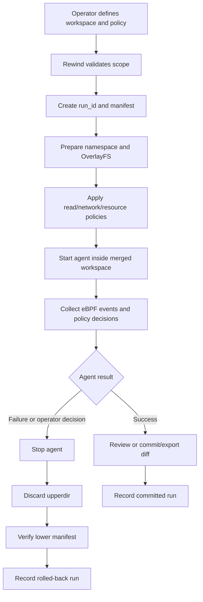
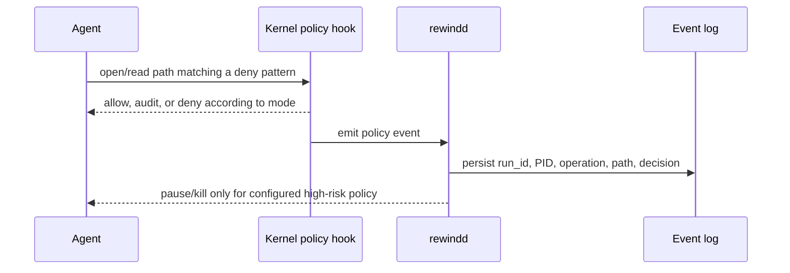
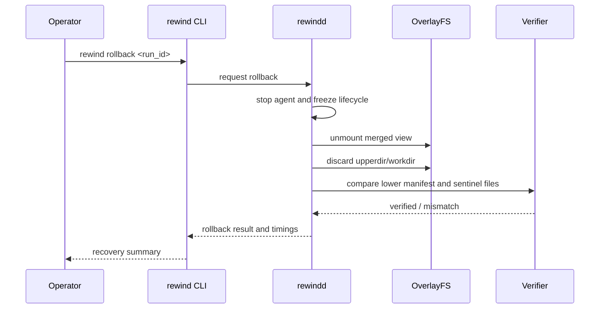
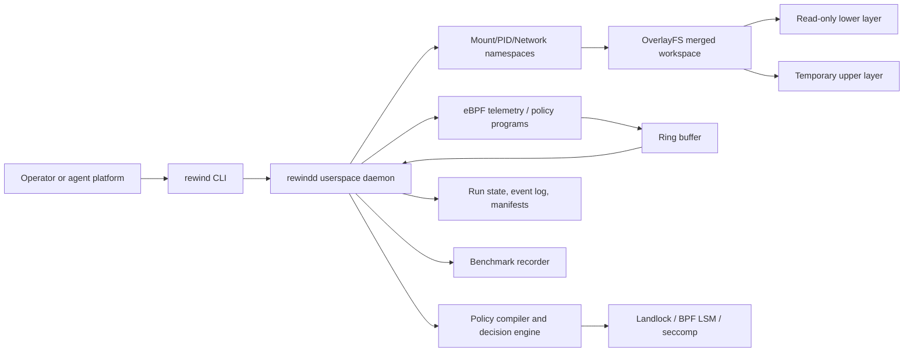
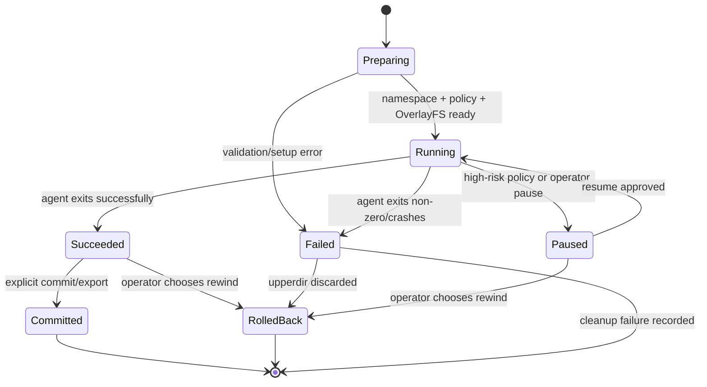

# RewindBPF — Technical Architecture and Business Flows

**Document status:** Living document

**Current stage:** Stage 4 — eBPF telemetry contract (execution gated)

**Last verified:** 2026-07-18
**Source of truth:** This document describes the current product behavior, target architecture, business flows, safety boundaries, and implementation status. It must be updated whenever an implementation stage is completed.

## 1. Product and business purpose

RewindBPF is an AI Agent Safety Runtime. It gives an AI agent a controlled execution transaction instead of direct, unrestricted access to a host filesystem.

The business problem is operational risk: an agent can make a destructive or confidential operation that a human did not anticipate. Traditional backup-before-every-operation approaches add too much I/O and latency. RewindBPF creates the protection boundary before the agent starts, then uses Linux filesystem and kernel capabilities to keep the hot path small.

The product promise is:

> Let an agent work normally inside a controlled transaction; observe its behavior; prevent unauthorized access; and rewind the transaction when the result is unsafe.

The product is not an AI agent. It does not plan tasks or generate code. It protects another agent.

## 2. Business actors and outcomes

| Actor | Need | RewindBPF outcome |
|---|---|---|
| Agent operator | Run an agent without risking the project or host | Starts a scoped transaction and can rewind it |
| Security owner | Define what agents may read or access | Provides path patterns and enforcement modes |
| Developer | Inspect what the agent actually did | Receives an event timeline and run status |
| Platform owner | Measure protection cost | Gets reproducible baseline and overhead reports |
| Judge/demo audience | See a credible failure and recovery | Watches deletion, denial, and one-command rollback |

## 3. Business flows

### 3.1 Safe agent run



### 3.2 Sensitive-read policy flow



### 3.3 Rollback flow



## 4. High-level architecture



### 4.1 Core components

#### `rewind` CLI

The user-facing command surface:

```text
rewind run --workspace PATH --policy POLICY -- COMMAND
rewind status [RUN_ID]
rewind events RUN_ID
rewind rollback RUN_ID
rewind commit RUN_ID
rewind policy check POLICY
```

#### `rewindd` daemon

The control plane. It owns run lifecycle, namespace setup, OverlayFS lifecycle, agent process management, policy loading, eBPF event consumption, manifests, and rollback verification.

The daemon is expected to run with narrowly scoped Linux capabilities inside the disposable lab. The agent itself should run unprivileged inside the sandbox.

#### eBPF programs

The kernel data plane observes target process/cgroup activity and emits compact events through a ring buffer. It does not create snapshots after the fact. Candidate observation points include `execve`, `openat/openat2`, `unlinkat`, `renameat2`, `write`, `pwrite`, `truncate`, and `ftruncate`.

For enforcement, use the appropriate hook and mechanism (BPF LSM, Landlock, seccomp, cgroup BPF). Tracepoints alone are telemetry, not a complete deny mechanism.

#### OverlayFS transaction

`lowerdir` contains the original fixture or rootfs. `upperdir` receives copy-up changes and whiteouts. `workdir` is required by OverlayFS and must satisfy the kernel filesystem requirements. The agent sees only `merged`.

#### Policy engine

User-facing glob patterns are compiled into filesystem access rules. The first read policy supports:

- `off`: do not enforce or audit reads.
- `audit`: allow but emit an event.
- `enforce`: deny and emit an event.

The engine must not perform expensive path regex matching in the kernel hot path.

## 5. Run lifecycle and state machine



Every run has a stable `run_id`, lifecycle status, policy revision, lower manifest, event stream, and timing record.

## 6. Policy model

Example user policy:

```yaml
read:
  mode: enforce
  deny:
    - "**/.env"
    - "**/*.pem"
    - "**/*.key"
    - "/home/*/.ssh/**"
    - "/data/pii/**"
  allow:
    - "/workspace/.env.example"

write:
  mode: rollback
  scope: workspace

network:
  mode: audit
```

Policy design rules:

1. `.env` is an example, not a hardcoded product rule.
2. Users can turn each policy family off, audit it, or enforce it.
3. Deny/allow precedence must be deterministic and documented.
4. `policy check` must show the paths affected before a run starts.
5. Real secrets and personal data must never be used in the test fixtures.

## 7. Isolation and safety boundary

### 7.1 Personal macOS host

The host is development-only. We must not run OverlayFS, eBPF, destructive filesystem, or host-wide bind-mount experiments directly on it.

### 7.2 Direct Ubuntu VM

The kernel MVP runs directly inside an Ubuntu VM managed by UTM on the macOS host. This keeps the Linux kernel, capabilities, mounts, and safety boundary explicit.

Recommended layout:

```text
macOS host
  └── disposable Ubuntu VM
        └── direct RewindBPF OverlayFS/eBPF integration tests
```

Never bind-mount the real project or personal home directory into a destructive test. Copy synthetic fixtures into the VM instead.

### 7.3 Full filesystem mode

System scope is supported only as a disposable VM/rootfs experiment. “Full host protection” means normal filesystem paths inside that disposable Linux environment; it does not claim reversible kernel, device, network, or firmware state.

## 8. Data and observability

Example event:

```json
{
  "run_id": "run_42",
  "pid": 1842,
  "operation": "unlinkat",
  "path": "/workspace/src/main.go",
  "timestamp_ns": 123456789,
  "decision": "allow",
  "risk": "high"
}
```

Persist:

- run lifecycle and policy revision
- lower-layer hash/metadata manifest
- eBPF event stream and dropped-event count
- policy decisions
- OverlayFS upperdir size
- visible recovery and full cleanup durations
- benchmark environment metadata

## 9. Verification invariants

The primary invariant is:

> After rollback, the lower layer is unchanged and sentinel files outside the protected scope are unchanged.

Additional invariants:

- A run cannot start if its isolation prerequisites are not satisfied.
- A daemon failure cannot silently turn a protected run into an unprotected run.
- A policy must be validated before the agent starts.
- A rollback result must include verification, not just an exit code.
- Event loss must be observable and reported.

## 10. Benchmark and test architecture

Benchmark groups:

| Group | Filesystem | eBPF | Daemon | Purpose |
|---|---|---:|---:|---|
| B0 | Native ext4 | No | No | Pure baseline |
| B1 | Native ext4 | Yes | No | eBPF-only cost |
| B2 | OverlayFS | No | No | OverlayFS cost |
| B3 | OverlayFS | Yes | No | eBPF + OverlayFS |
| B4 | OverlayFS | Yes | Yes | Product path |
| B5 | OverlayFS | Yes | Yes + policy | Enforcement cost |

Correctness tests use synthetic fixtures and compare manifests before/after rollback. Destructive tests are allowed only in a disposable VM or an explicitly created test image after a safety review.

## 11. Implementation status

| Stage | Status | Evidence |
|---|---|---|
| Bootstrap repository | Complete | Initial Go module, CLI, Makefile, policy example |
| English project documentation | Complete | README, plan, architecture, benchmark, eBPF, test docs |
| Stage 0 environment inventory | Complete | macOS arm64; Go 1.24.3 |
| Stage 1 fixtures/policy contract | Complete | Synthetic fixture generator, SHA-256 manifest, glob policy parser, run IDs, CLI smoke checks |
| Stage 2 disposable Linux lab | Complete | UTM Ubuntu 24.04.1 ARM64 VM; kernel 6.8.0-49; direct toolchain and capability audit verified |
| Stage 3 OverlayFS rollback | Lifecycle foundation complete; VM integration next | Synthetic smoke test passed; Go layout/mount/unmount/rollback manager and run state machine have unit tests without host mounts |
| Stage 4 eBPF telemetry | Event contract complete; kernel program next | Userspace schema is unit-tested; eBPF load still safety-gated |
| Stage 5 read policy | Not started | Safety gate required |
| Stage 6 system scope | Not started | Disposable VM only |
| Stage 7 benchmarks | Not started | Baseline first |

## 12. Change protocol

After each implementation stage:

1. Run only the tests authorized for that stage.
2. Record the result and environment in this document.
3. Update the business flow or sequence diagram if behavior changed.
4. Update the end-user instructions in `README.md`.
5. Commit the implementation and documentation together.

Before any risky test, stop and present:

- exact command(s)
- exact VM/filesystem scope
- required privileges
- expected side effects
- rollback/recovery path
- whether the test can touch the personal host

No destructive test is implicit permission to touch the personal computer.

## 13. Current Stage 1 implementation

Stage 1 is intentionally host-safe and kernel-free:

- `internal/fixture` creates synthetic workspace, fake secret, and fake PII files.
- `internal/manifest` records portable file structure, mode, size, symlink target, and SHA-256 content hashes.
- `internal/policy` parses YAML, validates `off/audit/enforce`, supports recursive `**` globs, and evaluates allow-over-deny decisions.
- `internal/runid` creates unique run identifiers for later lifecycle state.
- The CLI supports `fixture create`, `manifest create`, `manifest verify`, and `policy check`.

Verified Stage 1 commands:

```bash
go test ./...
go vet ./...
make build
rewind policy check policies/example.yaml
```

The CLI smoke test uses a randomly created temporary directory containing only synthetic data. It does not load eBPF, mount filesystems, or touch the personal project tree.

## 14. Reproducible VM setup

The primary lab is a direct Ubuntu VM installation created in UTM.

Recommended VM settings:

- Ubuntu Server 24.04 ARM64
- 4 virtual CPUs
- 8 GB RAM
- 40 GB virtual disk
- NAT/shared networking
- no host shared folders

Approved first execution sequence:

```text
UTM Ubuntu VM
  → install direct Linux toolchain
  → copy repository into VM
  → capability checks (read-only)
  → safety review
  → direct OverlayFS/eBPF integration
```

The first Stage 2 action is only read-only capability discovery inside the VM. No mount, eBPF load, or destructive command is implicit permission.

## 15. Stage 2 environment verification

The disposable VM reported the following on 2026-07-18:

```text
OS:       Ubuntu 24.04.1 LTS (Noble)
Arch:     aarch64
Kernel:   6.8.0-49-generic
bpftool:  /usr/sbin/bpftool
BTF:      /sys/kernel/btf present
Go:       1.22.2 linux/arm64
Clang:    18.1.3
bpftrace: 0.20.2
bpftool:  7.4.0 (libbpf 1.4)
OverlayFS: module available via modinfo, not loaded
LSM list:  lockdown,capability
Landlock: not enabled in this kernel LSM list
BPF LSM:  program type available
```

The direct Linux toolchain and BPF capability audit are complete. The OverlayFS module was loaded only for the controlled synthetic smoke test and the test mount was unmounted afterward. Landlock is not enabled in this VM kernel, so read enforcement must use BPF LSM or a future kernel with Landlock enabled. No eBPF program was loaded during either the capability audit or the smoke test.

## 16. Stage 3 OverlayFS smoke test result

The first controlled filesystem test ran only inside the disposable Ubuntu VM under `/home/vagrant/rewind-lab-smoke`.

Observed behavior:

```text
merged/marker.txt before write  → lower-layer-original
merged/marker.txt after write   → upper-layer-change
lower/marker.txt after write    → lower-layer-original
lower/marker.txt after unmount  → lower-layer-original
```

This verifies the core copy-on-write invariant: an agent-visible change is isolated in the upper layer while the lower layer remains unchanged. No personal Mac path or project checkout was mounted.

## 17. Stage 3 lifecycle implementation

`internal/overlay` now models one run’s `lower`, `upper`, `work`, and `merged` directories and provides:

- absolute-path and runtime-root validation
- safe directory preparation
- mount command construction
- unmount lifecycle
- rollback that unmounts first, then discards only validated upper/work paths
- injectable command runner for unit tests

The unit tests use a fake command runner on the development host. They verify path containment, rejection of `/` and unsafe mount-option characters, expected mount arguments, and lower-layer preservation. No Go unit test executes `mount`, `umount`, or `modprobe` on the personal Mac.

## 18. Engineering principles

The hackathon deadline does not remove the need for maintainable software boundaries.

### 18.1 One module, one responsibility

Keep these responsibilities separate:

```text
CLI             → parse user intent and render results
run lifecycle   → run IDs and state transitions; process ownership is a later daemon boundary
overlay         → lower/upper/work/merged filesystem lifecycle
policy          → parse, validate, compile, and evaluate rules
eBPF            → kernel event collection and narrowly scoped hooks
manifest        → content/metadata snapshot and verification
benchmark       → deterministic workloads and measurement
```

The CLI must not contain mount logic. The eBPF program must not contain business policy parsing. The policy package must not start processes. Each boundary should be testable without requiring the entire runtime.

### 18.2 Prefer explicit boundaries over premature abstractions

- Use small interfaces only where they enable safe tests or platform boundaries (for example, the OverlayFS command runner).
- Keep data structures plain and serializable.
- Avoid a plugin system, generic workflow engine, or framework layer until a concrete MVP requirement needs it.
- Prefer a clear package and a few cohesive files over one very large file.

### 18.3 Safety before convenience

- Validate paths before any filesystem operation.
- Fail closed when isolation prerequisites are missing.
- Keep destructive operations behind an explicit lifecycle method.
- Test policy and path logic with synthetic fixtures.
- Keep privileged operations inside the disposable VM.

### 18.4 Definition of done for a module

A module is ready when it has:

1. One clearly stated responsibility.
2. A small public API.
3. Unit tests that do not require unrelated kernel state where possible.
4. Error messages that identify the boundary and operation.
5. A short entry in this architecture document describing its role.

## 19. Stage 3 run lifecycle foundation

`internal/lifecycle` owns only the state machine for one protected agent run. It provides:

- a serializable run record with a stable `run_id` and lifecycle timestamps
- explicit states: `preparing`, `running`, `paused`, `succeeded`, `failed`, `committed`, and `rolled_back`
- validated transitions that prevent committing an unprepared run or resuming a terminal run

The package does not start processes, mount filesystems, parse policies, or load eBPF. Those operations remain separate integration boundaries for the daemon. Its tests run on the development host and require no kernel or privileged filesystem state.

## 20. Stage 4 event contract foundation

`internal/event` defines the narrow data contract between eBPF telemetry and userspace. It contains only primitive, serializable fields: run ID, PID, operation, optional path, kernel timestamp, decision, and risk level.

The package validates supported operation/decision/risk values before events are persisted. It does not read ring buffers, evaluate glob policies, or write logs. Kernel programs can therefore remain focused on collecting compact records while the daemon owns enrichment and persistence. Its tests run without loading eBPF or requiring Linux kernel state.
