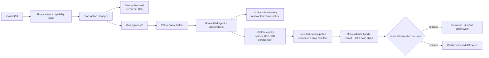

# RewindBPF Feature Backlog

**Status:** canonical delivery ledger  
**Last updated:** 2026-07-22
**Rule:** a feature is `shipped` only when its code path, unit tests, and (where privileged) disposable-VM evidence exist.

This ledger is the source of truth for the question “is the feature backlog finished?” The public site and other plans summarize this file; they must not turn a contract, scaffold, or fixture into a production capability.

## Delivery status

| Area | Status | What is actually shipped | Remaining acceptance gate |
|---|---|---|---|
| Reversible filesystem transaction | **Shipped** | FUSE OverlayFS transaction prepared before agent start; discard-by-default; rollback, recovery, diff, export, and conflict-checked commit | Broader filesystem compatibility matrix and long-running checkpoint research |
| Sensitive-read policy | **Shipped / Linux** | User-defined glob patterns with `off`/`audit`/`enforce`; Landlock planning and enforcement; policy explain/learn; secret contents are not logged | BPF-LSM acceleration where enabled; content-aware PII classification is post-product |
| Process and resource scope | **Shipped / Linux** | cgroup-v2 scope, descendant drain gate, PID/memory/CPU limits, fail-closed cleanup | Windows Job Object and macOS native process scope |
| eBPF evidence | **Shipped / Linux** | CO-RE trace sensor, start gate, sequence numbers, hash chain, dropped-event accounting, bounded cap, ordered rotation, standalone verifier | Kernel-side backpressure policy and remote signed evidence storage |
| Crash and stale-run recovery | **Shipped / Linux** | Parent death, open descriptors, stale FUSE mount, child drain, idempotent rollback/recover | Power-loss/startup matrix across filesystems |
| Network policy | **Shipped / Linux P1** | Explicit loopback HTTP/HTTPS proxy backend; `audit` persists observations and `enforce` applies allow/deny decisions in the run evidence chain for proxy-aware clients; enforce runs deny raw/packet sockets; explicit `deny` backend refuses non-proxy-aware egress; namespace backend resolves domains, moves a veth peer into the child namespace at the start gate, installs NAT/IPSet/iptables rules, supports atomic DNS/IPSet refresh, and can run an opt-in refresh loop with clean lifecycle shutdown; `rewind network plan` remains reviewable and the long-running leak smoke proves cleanup | Future per-agent network profiles and remote policy orchestration |
| Credential safety | **Shipped / Linux P1** | Capability-only references, default refusal, opt-in command and native macOS Keychain/Linux Secret Service providers with short-lived one-shot leases, expiry/revoke, no secret in lease JSON/argv/workspace, authenticated metadata endpoint, and callback-scoped one-shot consumption that clears the in-memory reader | Provider-specific secret-manager installation and future scoped network injection |
| Explicit acceptance | **Shipped / Linux** | Review-only JSON export, text-file unified patch export, full-fidelity Git patch export, manifest conflict checks, and clean-branch `rewind branch apply`; `rewind commit --confirm`; supervisor commit requires confirmation | Remote review workflow and richer provider adapters |
| Signed policy provenance | **Shipped / local trust** | Ed25519 keygen/sign/verify policy bundles, persisted envelope re-verification, signer key IDs, optional supervisor public-key allow-list enforcement, a fail-closed HTTPS registry client with retry, size bound, and pinned-key verification, plus an atomic file registry with list and marker-based revocation (`410 Gone`) | Organization trust distribution, KMS-backed registry durability, and revocation federation |
| Local supervisor | **Shipped / Linux + macOS native bridge** | Permissioned local socket/loopback HTTP, token auth, health/capabilities/history, status/rollback/recover/commit, native record snapshot/follow events, redacted action audit, history pruning, and expiring acquire/heartbeat/takeover/release session leases; `--session-backend sqlite` selects the WAL-backed store; native runs can persist to the same history index with `--history` | Windows native transaction actions, runtime-enforced multi-operator policy, and distributed session deployment |
| Control Plane UI | **Shipped / fixture + authenticated bridge** | Responsive operational views, local policy/workspace config store, loopback HTTP supervisor bridge, bearer-authenticated rollback/recover/commit and policy/workspace writes, authenticated SSE evidence follow with reconnect backoff, signed policy bundle import, credential lease metadata flow, retention pruning, detachable session controls, one-time supervisor-bound action-token challenges with replay refusal, and trusted registry list/fetch/revoke proxy UX | Server-side organization-level action policy beyond bearer + challenge boundaries |
| Public jury site | **Shipped** | Static modular single-page narrative, evidence-backed competitor matrix, roadmap, measured normalized benchmark ledger, storage/evidence/lifecycle callouts, and explicit local/S3 publish automation | External hosting credentials and post-hackathon content updates |
| Linux release/bootstrap | **Shipped / signed locally** | VM bootstrap, release Make targets, cross-build checks, SHA256SUMS, release metadata, and detached Ed25519 signature/verification with optional pinned public key | Public registry trust, key rotation/revocation, and package repository |
| macOS native backend | **Shipped / partial enforcement** | APFS clone-backed staged workspace, Seatbelt launcher, sensitive-read hiding from user-defined patterns/PII findings, review/diff/rollback/commit lifecycle, destination conflict checks, platform status/contract CLI, and signed-helper checksum/signature verification | EndpointSecurity telemetry, network/resource enforcement, signed helper entitlement, crash/power-loss acceptance, and destructive tests on disposable storage |
| Windows native backend | **Code-complete / manual gate** | Cross-build, fail-closed capability report, read-only PowerShell/fsutil prerequisite plan, Job Object/restricted-token contract, configurable kill-on-close Job Object launcher with wait/cleanup lifecycle, and signed-helper checksum/signature verification | Signed filesystem minifilter/service, restricted-token launch integration, disposable VHDX workspace, and Windows VM tests |
| Agent integrations | **Partial / lifecycle contract** | `--agent-adapter` validates and persists identity; adapter registry records executable aliases and `rewind/v1` prepare/start/exit hook contract; run IDs are injected into the child environment; `rewind agent list|contract` exposes the registry | SDK-specific launch semantics, callbacks, and provider tests |
| Durable remote retention | **Shipped / P1 transport** | Bounded local history and keep-latest pruning, AES-256-GCM encrypted evidence envelopes, checksum-indexed archives, detached Ed25519 signatures, multi-key trust rotation, explicit HTTPS/S3-compatible publish, bounded retries, digest-pinned fetch, and atomic retention restore | Production KMS/key lifecycle and provider-specific IAM remain deployment configuration |
| Detachable/ghost sessions | **Partial / local + SQLite + remote protocol** | Expiring authenticated acquire/heartbeat/takeover/release owner leases, reconnectable event follow, redacted session audit, atomic cross-process lock file, bearer-authenticated remote lease client with bounded retries, and a WAL-backed SQLite store with expiry/ownership tests | Distributed deployment/consensus and operational migration tooling |
| Content-aware PII protection | **Partial / bounded lifecycle coverage** | Deterministic bounded scanner detects common PII/token patterns; audit findings contain hashes only; `read.pii.mode: enforce` turns findings into exact Landlock denies before agent start; protected runs rescan newly-created files after exit; event paths and proxy hosts are redacted before evidence persistence; configurable regex rules, streaming limits, and no-leakage tests | Configurable classifiers beyond regex, VM leakage benchmark runs, and richer event-level finding metadata |
| Multi-agent/checkpoint graph | **Partial / live lifecycle foundation** | Durable dependency graph with parent validation, deterministic state transitions, pending-child merge guard, descendant-first rollback, CLI transitions, and protected-run lifecycle wiring | Full multi-agent orchestration, durable remote graph store, and process-memory checkpoints |

## What this means before tests

The **Linux demo and product-core feature set is complete enough to enter the verification phase**. The macOS native filesystem lifecycle is implemented and synthetic-fixture tested; its EndpointSecurity/network/resource helper gates remain. Windows is cross-buildable but still contract-only pending its signed helper and disposable VHDX acceptance. Remote integrations and classifier research remain separate product tracks.

After the final P0 gate, the remaining items are verification maintenance or explicitly staged productisation:

1. Keep the documentation/site status synchronized with the shipped supervisor, commit path, proxy backend, event rotation, branch acceptance, evidence bundles, normalized benchmark ledger, and trust UX.
2. Add and maintain contract tests for every `partial` or `unavailable` capability so unsupported paths fail closed.
3. Repeat the disposable-VM gate when runtime or kernel-facing code changes; do not run privileged or destructive tests on the development Mac.

Everything else in the table is a deliberately staged post-demo/productisation item, not a hidden unfinished P0 feature.

## Verification evidence

On 2026-07-21, the disposable Ubuntu 24.04 ARM64 VM passed
`REWIND_VM_CONFIRM=VM_ONLY make final-vm` after bootstrapping packages,
rebuilding the Go binary
and eBPF object. The gate covered:

- Landlock sensitive-read denial and recursive delete rollback;
- review plus explicit conflict-checked commit;
- destination drift refusal with no partial apply;
- proxy allow/deny for a local HTTP endpoint and `example.invalid`; and
- strict deny/no-route namespace isolation plus real allow-listed namespace
  egress through a temporary veth/IPSet/NAT chain; and
- bounded-event evidence marked incomplete and rejected by verification;
- the deterministic jury demo, release metadata, and cross-platform checksum
  verification.

The network case also persisted one `allow` and one `deny` `network_connect`
event in the ordered hash-chained evidence stream. The same acceptance matrix
verified that an enforce-mode agent receives `EPERM` when creating an IPv4 raw
socket, while the ordinary proxy path remains usable. A second enforce-mode
case verified the new `--network-backend deny` path: IPv4 socket creation was
refused while Unix-domain socket creation remained available.

The separate supervisor smoke also passed: the mode-`0600` Unix socket returned
`401` without a bearer token, authenticated status and explicit commit succeeded,
and the redacted action audit contained the commit record.

The P1 lifecycle leak smoke also passed in the same VM: three repeated
long-lived-child runs rolled back with no surviving cgroup scope, process,
mounted merged view, veth, IPSet, or `REWIND_ALLOWLIST` iptables chain. The
final-vm evidence directory contains `logs/p1-leak.log` and its checksum.

The new content-aware gate also passed in the disposable Ubuntu 24.04 ARM64 VM
on 2026-07-20. A synthetic file containing `alice@example.com` was denied by
`read.pii.mode: enforce` before the agent could read it, while an ordinary
generated file remained writable in the merged layer; rollback preserved the
original lower file.

Host-side `go test ./...`, `go vet ./...`, UI syntax checks, and shell syntax
checks also pass. Privileged OverlayFS/eBPF tests remain VM-only by design.

## Recommended next phases

### P0 — Verification gate (current)

Run unit, static, UI, and disposable-VM integration tests; verify rollback, read denial, process drain, evidence integrity, commit conflicts, supervisor auth, and proxy enforcement.

### P1 — Linux productisation (complete)

The local fail-closed network boundary, signed evidence hand-off, release signing,
authenticated supervisor, connected Control Plane mutation, isolated Linux network
namespace backend with atomic and scheduled allowlist refresh, credential provider
leases with scoped one-shot consumption, atomic digest-pinned remote restore, and
the long-running cgroup/network leak smoke are shipped and tested. Production KMS
key lifecycle, provider-specific IAM, per-agent network profiles, and distributed
deployment remain configuration/productisation work rather than unfinished P1
runtime code.

### P2 — Native macOS

The Go-side Seatbelt launcher, platform capability matrix, helper trust gate,
and native contract are complete. The remaining gate is manual: validate
Seatbelt/EndpointSecurity plus APFS clone/snapshot or disposable workspace on
disposable storage, then install the signed helper and run the destructive
acceptance matrix. Report a native capability matrix and refuse any
unsupported promise.

### P3 — Native Windows

The Go-side Job Object lifecycle, platform capability matrix, helper trust gate,
and native contract are complete. The remaining gate is manual: install the
signed minifilter/service, validate restricted-token launch and a disposable
VHDX workspace, then run the Windows acceptance matrix. Keep WSL2 explicitly
separate from Windows-host protection.

### P4 — Scale and ecosystem

Add distributed detachable sessions, remote retention/registry, SDK-specific agent adapters, multi-agent transaction graphs, runtime content-aware PII controls, and checkpoint research. Local leases, encrypted hand-off, adapter identity, and deterministic audit scanning are already shipped.

## Phase 2 plan and research

The former standalone Phase 2 plan is consolidated below so this file remains
the single source of truth for shipped features, acceptance gates, research,
and the next delivery phases.

**Status:** P0 final VM gate complete; macOS safe/native/crash smokes complete; Windows privileged-helper acceptance remains platform-specific
**Owner:** RewindBPF team
**Last updated:** 2026-07-21
**Decision horizon:** Hackathon demo in six days, followed by a 90-day productisation track

### 1. Executive decision

The MVP is ready to demonstrate in the disposable Ubuntu VM. Phase 2 should not try to add every Linux security primitive at once. The highest-value work is to make the current transaction boundary correct under failure, make policy scope complete for the whole process tree, and make the evidence reproducible.

The strategic correction after the nono comparison is recorded in [`docs/PRODUCT_STRATEGY.md`](PRODUCT_STRATEGY.md). RewindBPF will not become a less mature general-purpose sandbox. Its wedge is the user-visible combination of immutable project writes, invisible secrets, explicit acceptance, and fail-closed trust.

The Phase 2 product promise is therefore:

> **Let an agent work aggressively without giving it direct access to the real project or real credentials; accept only the reviewed result.**

The implementation promise underneath is: run an unmodified AI agent inside a pre-created, reversible Linux transaction; enforce least-privilege reads before execution; observe the complete process tree; and prove rollback or commit with verifiable evidence.

### 1.1 P0 priority reset

P0 is now organized by user outcome, with a runtime workstream and a matching Control Plane workstream:

| Promise | Runtime P0 | UI P0 | Proof |
|---|---|---|---|
| Immutable project | Default-discard successful runs; explicit review/hold opt-in; no lower-layer writes before acceptance | Show `DISCARD BY DEFAULT`, upper-layer size, lower-layer integrity, and explicit `Review`/`Discard` actions | Destructive delete, rename, overwrite, and rollback fixture |
| Invisible secrets | Enforce user-defined sensitive-read patterns; record deny decisions without secret contents | Policy simulator, secret-path decision timeline, capability/degraded state | `.env`, SSH, key, PII synthetic fixtures |
| Explicit acceptance | Review export first; `rewind commit --confirm` applies only after destination manifest checks pass | Show the conflict gate, commit confirmation, and export/discard paths | Destination drift must refuse apply |
| Fail-closed trust | Cleanup, process drain, mount state, event drops, truncation, and unsupported backends become explicit failure states | Evidence health, degraded backend banner, recovery progress, and actionable error states | Fault-injection matrix and incomplete-evidence verification |

P0 scope excludes durable snapshot history, detachable sessions, registry features, local authentication, and privileged native helper acceptance. The macOS APFS-clone + Seatbelt staged lifecycle is now implemented and synthetic-fixture tested; EndpointSecurity/network/resource enforcement and minifilter/VHDX acceptance remain platform-specific manual work.

#### P1 implementation boundary

The first product-core slice adds three explicit, portable contracts:

- `internal/netpolicy` compiles allowlisted domains and provides a loopback HTTP/HTTPS proxy backend for proxy-aware clients. The explicit `deny` backend fails closed for non-proxy-aware clients; the Linux `namespace` backend now resolves domains, moves a veth peer at the start gate, installs IPSet/iptables NAT rules, and cleans them on every lifecycle path. Privileged VM egress evidence remains the acceptance gate.
- `internal/credentials` exposes capability references, an opt-in command provider, and short-lived leases. Raw values have no representation in policy, lease JSON, argv, or workspace files; native keychains remain platform-specific.
- `internal/acceptance` compares the immutable base, destination, and candidate manifests and rejects same-path drift before `rewind commit --confirm` applies regular-file and directory changes.

The Control Plane fixture exposes these states as operational UI: network mode is visible, the broker is visibly refusing, and “Test boundary” explains why a secret is never injected. This makes the boundary visible while preserving the API shape for native backends.

##### P1 completion (2026-07-21)

P1 Linux productisation is complete for the runtime boundary. The namespace broker now has a repeatable three-iteration leak smoke that verifies cgroup drain, mount cleanup, owned veth/ipset/iptables cleanup, and no surviving run processes. Credential leases expose a callback-scoped one-shot consumer that clears the reader on close instead of requiring environment or file injection. S3-compatible retention now supports bounded retries, response/expected digest pinning, and atomic restore into a protected temporary file before rename. The existing encrypted envelope, detached signatures, pinned-key rotation, and supervisor/Control Plane paths remain part of the same evidence flow. KMS/IAM setup, distributed deployment, and per-agent policy profiles are explicit deployment tracks, not hidden runtime gaps.

#### P4 implementation boundary

`internal/history` stores bounded, durable run summaries with atomic JSON
replacement and keep-latest pruning. `internal/supervisor` now exposes a
permissioned Unix-socket transport with bearer-token-authenticated lifecycle
actions, snapshot/follow event streams, redacted action audit, history pruning,
and expiring acquire/heartbeat/takeover/release session leases. The browser
adapter can reconcile and manage those local leases; distributed session
coordination remains deployment work.

This is deliberately narrower than “protect the whole operating system” or “zero overhead.” OverlayFS protects filesystem changes inside the selected boundary. Landlock protects the selected read/write hierarchy. eBPF supplies low-cost telemetry and optional enforcement where the kernel supports it. Network, kernel state, devices, external services, and already-open descriptors remain explicit safety boundaries.

### 2. What the MVP proved, and what it did not
#### Verified MVP evidence

- A FUSE OverlayFS-backed protected run completed in the disposable Ubuntu 24.04 ARM64 VM.
- A synthetic secret read was denied by Landlock; deleting `src/` affected only the merged view.
- Rollback restored the original lower layer and removed generated files.
- The eBPF sensor emitted `openat`, `write`, `unlinkat`, `renameat2`, `truncate`, `socket`, and `execve` telemetry.
- Descendant tracking was verified with a shell-launched `dd` process: 46 events across two PIDs.
- Warm B4 throughput was approximately 11.1% below native B0 and approximately 0.4% above FUSE-only B2. This indicates that the measured steady-state cost is dominated by the FUSE backend, not a proven “zero-cost” Rewind layer.
- Cold B4 was materially slower because each run included mount setup, helper startup, and first copy-up. It is a lifecycle measurement, not a hot-path overhead result.

#### Known MVP gaps

1. The record and event log are now restored to the invoking user after `sudo`; the privileged FUSE mount still requires `sudo` for unmount/rollback.
2. Cgroup-v2 is now the primary process identity and drain boundary; PID descendant tracking remains in the eBPF sensor for event correlation and compatibility.
3. The event stream is JSONL and can grow much faster than the run record; kernel-side reserve failures are now counted and make evidence incomplete. A bounded `REWIND_EVENT_MAX_BYTES` cap marks userspace truncation explicitly, while `REWIND_EVENT_ROTATE_BYTES` rotates the stream into ordered files without resetting the hash chain. The read-only evidence verifier checks the combined digest and chain; backpressure remains future work.
4. macOS synthetic `SIGKILL` rollback is covered by `make mac-crash-smoke`; Linux startup/open-descriptor/power-loss recovery remains a disposable-VM acceptance gate.
5. Conflict-aware `commit --confirm` is now implemented for regular files/directories. It refuses incomplete evidence, destination drift, unsafe paths, and symlink/other entries; JSON export, text-file unified patches, and full-fidelity Git patches are review artifacts, while `rewind branch apply` adds a clean-checkout, Git-preflighted branch adapter with explicit optional commit.
6. Kernel OverlayFS and FUSE OverlayFS have different capabilities and performance. Backend selection is explicit, but the capability report and compatibility matrix are not yet productised.
7. Network policy now has an explicit loopback proxy backend for HTTP/CONNECT proxy-aware clients, a strict seccomp deny backend, and a Linux network-namespace broker. Enforced proxy runs deny AF_PACKET and raw AF_INET/AF_INET6 socket creation through seccomp; namespace runs resolve configured domains and DNS resolvers, move a veth peer into the child namespace at the start gate, enforce an IPSet-backed destination allowlist with NAT/default reject, atomically refresh DNS-derived destinations through an IPSet swap, and optionally repeat that refresh for the lifetime of the run with deterministic shutdown. The privileged veth/iptables path has passing disposable-VM acceptance evidence; long-running leak measurement remains operational hardening.

#### Phase 2 implementation progress

##### P0 final gate result (2026-07-21)

The disposable Ubuntu 24.04 ARM64 UTM VM completed `REWIND_VM_CONFIRM=VM_ONLY make final-vm` successfully. The evidence directory and compressed archive contain the logs, normalized benchmark data, release metadata, and checksums. The gate covered:

- Cross-built Linux amd64/arm64, macOS arm64, and Windows amd64 binaries, CO-RE eBPF object, example policy, release metadata, and SHA-256 verification.
- B0/B2/B4/B5 benchmark normalization, chart generation, and ledger verification.
- Rollback/read denial, review/commit, clean branch, destination-drift conflict refusal, proxy allow/deny, raw socket enforcement and audit semantics, strict non-proxy deny, isolated namespace egress, allow-listed veth/IPSet/NAT egress, and incomplete-evidence refusal.
- Jury demo: destructive `src/` removal stayed in the transaction layer, the synthetic sensitive read was denied, and rollback restored the original workspace.

The final VM gate is now the authoritative privileged Linux acceptance command; the local Mac remains limited to safe/native fixture tests.

The P0 implementation is now complete and verified in the disposable VM:

- `mounted` lifecycle state plus prepared run journal before mount/agent start.
- Idempotent `rollback` and explicit `recover` for stale records.
- Per-run cgroup-v2 creation, helper admission, descendant inheritance, and cleanup.
- Read-only `capabilities` probe persisted in the run plan.
- Invoker-owned record and event log after privileged execution.
- Helper start gate that releases the agent only after sensor attachment.
- Event count, byte count, SHA-256 digest, kernel-side dropped-event count, sequence numbers, a userspace hash chain, and complete/truncated JSONL evidence flag.
- Read-only `diff --record` manifest comparison for a live merged view.

The VM smoke recorded 77 events (14,428 bytes) for a short synthetic command with `dropped=0`, and rollback preserved the lower-layer marker. A follow-up synthetic destructive run recorded 39 events (7,334 bytes), `dropped=0`, and rolled back successfully. A background `sleep` child was then detected by the cgroup drain gate; the run failed closed, rolled back, and left no child process or cgroup behind. Finally, a `SIGKILL` parent crash left a `running` record; `rewind recover` accepted the already-torn-down FUSE mount, killed/drained the scope, discarded upper/work, and restored the lower marker. An open-descriptor crash smoke wrote through fd 9 in the merged layer, was forcibly terminated, and recovered with the lower marker unchanged. A VM-only small-ring stress test intentionally dropped 37 events from 50,000 writes; the run record remained `dropped=37`, `complete=false` after rollback, and `rewind verify` exited 2. P0 now includes sequence/hash-chain evidence in addition to kernel drop accounting. The review-only `rewind export`, `policy learn`, optional cgroup resource-limit workflow, independent evidence verifier, ordered JSONL rotation, network proxy path, conflict-checked commit, authenticated supervisor actions, final benchmark ledger, release bundle, and deterministic jury demo are implemented. Broader filesystem/power-loss coverage, explicit backpressure, native privileged helpers, and remote productisation remain staged work rather than hidden P0 blockers.

### 3. Research and competitive findings

The market does not have a clean “nobody does kernel-level agent safety” gap. The defensible opportunity is the composition and proof boundary: RewindBPF combines a pre-run writable filesystem transaction, configurable read confidentiality, kernel telemetry, and a run-level rollback state machine in one Linux-first workflow.

| System | Primary strength | RewindBPF overlap | Phase 2 implication |
|---|---|---|---|
| [nono](https://nono.sh/os-sandbox) | Landlock/Seatbelt allowlists, child inheritance, profiles, undo and audit for agents | Kernel filesystem isolation and agent-oriented undo | Treat Landlock policy UX, profile discovery, and cross-platform capability reporting as the benchmark for our policy surface; differentiate on explicit OverlayFS transaction semantics and Linux rollback evidence. |
| [Cilium Tetragon](https://tetragon.io/docs/getting-started/enforcement/) | eBPF observability and enforcement for process, file, and network events | eBPF event collection and sensitive-file enforcement | Reuse the idea of in-kernel filtering, but keep RewindBPF agent/run identity and rollback as the product boundary; add event-loss accounting and cgroup scope. |
| [KubeArmor](https://docs.kubearmor.io/kubearmor/quick-links/kubearmor_overview/runtime_enforcer) | AppArmor, SELinux, and BPF-LSM policy translation for workloads | Policy modes and kernel enforcement | Build a backend capability matrix rather than assuming BPF-LSM; Landlock is the portable unprivileged default, BPF-LSM is an optional accelerator/enforcer. |
| [AgentFS](https://www.agentfs.ai/) | SQLite-backed isolated, auditable, snapshot-able agent filesystem | COW isolation, history, rollback | Match queryable change history and exportability without replacing the native Linux filesystem; add a portable run manifest and diff index. |
| [OpenHands Docker sandbox](https://docs.openhands.dev/openhands/usage/sandboxes/docker) | Practical container runtime for agent execution | Agent-agnostic execution boundary | Position RewindBPF as a filesystem transaction that can sit inside a VM or container, not as a replacement for container/VM isolation. |
| [DeltaBox](https://arxiv.org/abs/2605.22781) | Research direction for millisecond agent checkpoint/rollback using layered filesystem/process state | Checkpoint and rewind objective | Borrow the layer-switching and checkpoint vocabulary, but publish measured limitations and avoid claiming research-level process checkpoint/restore until it is implemented. |

#### Competitive conclusion

Phase 2 must stop treating “kernel-level” as a differentiator by itself. The differentiators to prove are:

- **Prepared transaction:** the write layer exists before the agent starts; eBPF is not a post-hoc backup trigger.
- **Two independent safety planes:** filesystem rollback for integrity, and Landlock/BPF-LSM policy for confidentiality/prevention.
- **Agent-agnostic process scope:** no SDK or agent rewrite; all descendants are covered.
- **Evidence-first lifecycle:** every run has a state, policy digest, backend, event-loss status, manifest, and rollback/commit result.
- **Capability-based portability:** capability detection chooses kernel OverlayFS, FUSE OverlayFS, Landlock, or a safe refusal instead of silently weakening the guarantee.

#### Competitive benchmark strategy

The comparison is deliberately two-layered. RewindBPF owns the primary, reproducible B0/B2/B4 dataset in the disposable Ubuntu VM. Competitor numbers are added only when the same tool, version, kernel, workload, and policy boundary can be reproduced; otherwise the cell is labeled “published” or “not comparable.”

| Competitor | What we can measure fairly | What remains non-comparable |
|---|---|---|
| nono | Startup, policy-denied read latency, mixed file I/O, undo time, storage growth, audit bytes, and fork/exec coverage | Different sandbox/undo implementation and backend; no universal overhead ranking from one VM |
| Tetragon | Event throughput, CPU/memory, drop behavior, decision latency, and process-tree visibility | It is not a filesystem transaction or rollback engine |
| KubeArmor | Rule-install and deny latency, event throughput, CPU/memory, and enforcement coverage in its supported workload | Kubernetes policy deployment is a different product boundary from a local agent run |
| AgentFS | Write/snapshot/restore/query latency, logical vs physical bytes, and export size | SQLite/filesystem abstraction is not native ext4 + OverlayFS syscall behavior |
| DeltaBox | Published paper numbers with exact configuration, or an author artifact reproduction | Research checkpoint scope and workload cannot be treated as a product benchmark by default |

The benchmark ledger therefore reports measurement provenance (`measured`, `published`, or `not comparable`) beside every external value. The jury-facing claim is not “faster than every competitor”; it is that RewindBPF measures the cost of its explicit safety invariant—pre-created COW writes plus kernel telemetry—and makes the tradeoff auditable.

The jury-facing single-page site in `site/` now presents this same distinction: shipped capabilities first, planned work second, then a capability matrix and the measured B0/B2/B4 bars. The site is a static presentation layer; the Markdown architecture and benchmark ledgers remain canonical. The read-only `internal/evidence` verifier now backs `rewind verify`, `rewind evidence verify`, and the separately buildable `rewind-evidence` binary.

### 3.1 Nono parity track

Nono is the closest product benchmark, so its publicly documented feature set becomes a checklist rather than a vague comparison. The goal is feature parity where it materially improves agent safety, not a blind reimplementation of its architecture.

| Publicly documented nono capability | RewindBPF MVP state | Phase 2 decision | Longer-term position |
|---|---|---|---|
| Kernel isolation and inherited child restrictions | Landlock read policy plus PID descendant telemetry; FUSE transaction | **P0:** cgroup-v2 scope, capability report, policy preview, and explicit degraded mode | Keep Linux-first Landlock/BPF-LSM backends; consider other OS backends only after Linux correctness. |
| Profile-based policy and `learn` workflow | YAML policy, glob deny patterns, `off/audit/enforce` | **P0:** versioned policy schema, `policy learn`, explain/validate commands | Signed, composable profiles with toolchain/runtime groups. |
| Atomic undo and content-addressed snapshots | OverlayFS/FUSE upper-layer discard; SHA-256 start manifests | **P0:** diff index, rollback evidence, crash recovery; **P1:** deduplicated content store if storage measurements justify it | Multiple checkpoints and portable run bundles. |
| Cryptographic audit trail/Merkle commitment | JSONL telemetry and run record; no final Merkle root | **P0:** sequence numbers, drop counters, hash-chained batches, final root, read-only verifier | Signed remote evidence and standalone packaging. |
| Domain/network filtering | Policy field plus loopback proxy backend for proxy-aware HTTP/HTTPS clients; enforce mode denies raw/packet socket creation; explicit `deny` and Linux `namespace` backends refuse non-proxy-aware egress | **P1:** allow-listed network namespace/cgroup backend for non-proxy-aware clients and broader egress coverage | Credential-aware egress broker and per-agent network profiles. |
| Credential injection without exposing raw keys | Refusing broker plus opt-in external command provider with short-lived one-shot leases and authenticated metadata endpoint | **P1:** provider MVP and no-secret serialization contract shipped | Native keychain/secret-manager adapters and scoped injection protocol. |
| Runtime supervisor and dynamic permission approval | Authenticated Unix-socket supervisor with lifecycle actions, snapshot/follow streams, redacted audit, and an optional loopback HTTP bridge for browser actions | **P1:** live SSE reconciliation, connected policy mutation, and approval protocol | Policy decision service with human/automation approval and time-bounded grants. |
| Signed provenance/registry for profiles and agent packs | Local Ed25519 bundles and verification only | **P2:** document trust boundary and sign release artifacts | Sigstore-compatible profile/adapter registry. |
| Detachable/ghost sessions | Expiring authenticated local session leases with event follow and explicit takeover | **P2:** local lease shipped; distributed coordination remains | Persistent run handles with reconnect, retention, and operator takeover across supervisors. |

The priority is intentional. Nono already demonstrates a broad product surface: kernel isolation, undo, audit, provenance, supervision, network filtering, credential injection, and detachable sessions ([feature overview](https://nono.sh/), [undo](https://nono.sh/undo), [audit trail](https://nono.sh/audit-trail), [profile learning](https://nono.sh/blog/nono-learn-policy-profile)). RewindBPF should first close the correctness and evidence gaps that would make our rollback claim unreliable, then add network/credential/supervisor features as separate policy planes. A six-day sprint that starts with a registry, durable history, or UI polish would create parity theatre without a stronger safety invariant. The complete product strategy, including native macOS and Windows tracks, lives in [`docs/PRODUCT_STRATEGY.md`](PRODUCT_STRATEGY.md).

#### What RewindBPF should do better than nono

These are product hypotheses to validate, not current claims:

1. **Transaction-native writes:** make the lower/upper/merged filesystem boundary the primary object from which diffs, rollback, and future commit are derived, instead of treating undo as a post-session snapshot feature.
2. **Filesystem and policy timeline in one run:** correlate the eBPF event stream, Landlock decisions, process/cgroup identity, upper-layer diff, and final state in one evidence bundle.
3. **Conflict-safe export:** make `commit` refuse when the destination lower manifest changed, then export a reviewable JSON bundle or full-fidelity Git patch rather than overwriting the live workspace.
4. **Capability reporting:** report exactly which guarantees are active on this kernel (Landlock ABI, BPF-LSM, cgroup-v2, OverlayFS/FUSE, network backend) and fail closed when an enforce-mode guarantee cannot be provided.
5. **Agent-agnostic deployment:** keep the core runtime independent of Claude/Codex/OpenHands/etc.; integrations remain thin adapters.

### 4. Phase 2 goals and non-goals

#### Goals

1. Make failure behavior deterministic: crash, `SIGKILL`, helper failure, mount failure, event loss, and interrupted rollback.
2. Replace PID-only identity with cgroup-v2 scope, retaining PID tracking as a fallback for the MVP VM.
3. Make policies auditable and composable: read, write, execute, network, resource, and mode/capability reporting.
4. Make rollback and future commit explicit transactions with manifests, diffs, and conflict checks.
5. Produce a reproducible benchmark harness with warm/cold, kernel/FUSE, telemetry on/off, and storage amplification dimensions.
6. Package the workflow so a reviewer can install one binary, run one safe synthetic demo, and understand exactly what is protected.

#### Non-goals

- Reversing network requests, cloud mutations, kernel/device state, database transactions, or external side effects.
- A generic VM/container replacement.
- Automatic semantic judgement of whether an agent’s code change is “good.”
- Mandatory content inspection or PII classification of every file. An optional
  bounded audit scanner may run out-of-band, but it must never replace path
  policy or silently grant access.
- Rootless system-wide protection on arbitrary host filesystems without a tested kernel/filesystem capability matrix.
- Claiming zero overhead; report measured overhead by backend and workload.

### 5. Six-day execution plan

Each day has a demonstrable exit criterion. All privileged or destructive commands remain VM-only and require a safety review before execution.

#### Day 1 — Transaction correctness and crash recovery (P0)

**Build**

- Make successful runs discard the upper/work layer by default. Add an explicit `--on-success review` opt-in for inspection; never require the operator to remember a later rollback just to keep the lower layer safe.
- Add an explicit run journal with atomic state transitions: `planned → mounted → running → succeeded|failed → rolled_back|committed`.
- Persist the policy digest, lower/upper/work/merged paths, backend, kernel capability report, helper PID/cgroup, and event sequence counters.
- Add startup recovery: detect stale `mounted/running` records, unmount safely, preserve evidence, and mark the run `aborted` rather than silently deleting data.
- Make rollback idempotent and verify that no merged mount remains.
- Write metadata with the invoking `SUDO_UID`/`SUDO_GID` where safe; otherwise print the exact privileged inspection command.

**Tests**

- Kill the helper at each lifecycle edge; kill the parent during agent execution; interrupt rollback twice.
- Restart the CLI and recover stale records.
- Verify lower-layer hashes before/after every failure injection.

**Exit criterion:** 100% of injected lifecycle failures leave either a mounted run with recoverable evidence or a cleanly unmounted, rolled-back run; never a false `succeeded` state.

#### Day 2 — Process-tree and policy boundary hardening (P0)

**Build**

- Create one cgroup-v2 per run and place the helper/agent process tree in it before execution.
- Prefer cgroup identity in eBPF filtering; retain descendant-PID maps only as a compatibility fallback.
- Add a process-exit and cgroup-empty gate before unmount/rollback.
- Define policy precedence: deny beats allow, explicit paths beat globs, and unsupported rights fail closed in `enforce` mode.
- Add `execute` and `refer`/rename coverage to the policy capability report, even if the first backend cannot enforce every right.

**Tests**

- Shell → `dd` → background child → detached child; verify all events and cleanup.
- Attempt `setsid`, double-fork, `execve`, symlink traversal, hard links, rename across directories, and `/proc` path aliases.
- Run with an unsupported Landlock ABI and confirm the result is an explicit degraded mode or refusal.

**Exit criterion:** no tested child-process escape; every run reports its exact process-scope mechanism and any fallback.

#### Day 3 — Policy and enforcement depth (P0/P1)

**Build**

- Stabilise a versioned YAML schema with `read`, `write`, `execute`, `network`, `resources`, `scope`, `mode`, and backend capabilities.
- Add `audit` mode that records denied-intent events without blocking; add `enforce` mode that denies before the operation.
- Keep Landlock as the default unprivileged filesystem enforcement backend.
- Add an optional BPF-LSM enforcement adapter for kernels with active `bpf` LSM; never silently select it when `/sys/kernel/security/lsm` does not contain `bpf`.
- Add a policy “learn” command that converts observed paths into a reviewable allowlist; never auto-allow secrets or broad parent directories. Implemented: output defaults to `audit`, refuses to overwrite an existing file, and filters secret-like, virtual, and broad paths. The read-only `policy explain` preview keeps deny-before-allow precedence.

**Tests**

- Synthetic `.env`, SSH key, token, symlink, hard link, mmap write, truncate, rename, and directory deletion cases.
- Compare `off`, `audit`, and `enforce` decisions and confirm that read denial does not rely on the agent’s cooperation.

**Exit criterion:** a reviewer can express a custom sensitive-file pattern, preview its effect, and demonstrate both audit and enforce behavior with a deterministic fixture.

#### Day 4 — Telemetry integrity and usable evidence (P1)

**Build**

- Add a bounded ring-buffer/event pipeline with sequence numbers, dropped-event counters, backpressure policy, and rotation limits. Implemented slices: `REWIND_EVENT_MAX_BYTES` caps total retention, `REWIND_EVENT_ROTATE_BYTES` rolls the JSONL stream into ordered files while preserving the chain, and the reader continues draining the ring; capped streams persist `truncated=true` so verification fails closed.
- Store compact JSONL for streaming plus a queryable run index (SQLite or an append-only compact format) for summaries.
- Hash-chain event batches and include the final digest in the run record; document that this is tamper evidence, not a trusted remote log.
- Add `rewind diff` to summarize created, modified, deleted, renamed, and policy-denied paths without printing secret contents. The non-mutating JSON and text-file patch exports are implemented; conflict-checked commit remains separate.
- Add `rewind capabilities`, `rewind inspect`, `rewind verify`, and machine-readable status output.

**Tests**

- Saturate the ring buffer and assert that a run cannot claim complete telemetry when events were dropped.
- Rotate logs, crash the writer, truncate the last line, and verify recovery behavior.
- Confirm that secret paths are redacted in summaries while exact policy decisions remain inspectable.

**Exit criterion:** every run has a bounded, verifiable evidence bundle and an explicit `events_complete`/`events_dropped` result.

#### Day 5 — Backend, storage, and benchmark rigor (P1)

**Build**

- Keep the read-only capability probe authoritative for kernel OverlayFS, FUSE OverlayFS, Landlock, BPF-LSM, cgroup-v2, and seccomp support; enforce-mode raw-socket defense refuses the run before mount/process release when seccomp is unavailable.
- Keep kernel OverlayFS and FUSE OverlayFS as separate measured backends; refuse incompatible combinations instead of guessing.
- Add workload classes: small-file tree, full-file overwrite, sparse overwrite, delete/rename storm, read-only workload, and mixed agent build workload.
- Add warm/cold order randomisation, at least five repetitions for warm and three for cold, and confidence intervals.
- Track upper bytes, work bytes, event bytes, record bytes, copy-up ratio, peak usage, rollback time, and cleanup time alongside IOPS/latency.

**Tests**

- Re-run B0/B2/B4/B5 with telemetry disabled/enabled and both backends where supported.
- Verify storage after rollback and after failed runs; no orphan upper/work trees.

**Exit criterion:** charts separate steady-state I/O overhead, lifecycle overhead, first-copy-up cost, telemetry cost, and storage amplification.

#### Day 6 — Demo, release gate, and public evidence (P0)

**Build**

- Produce one deterministic three-act demo: destructive delete → secret-read denial → rollback proof.
- Add a failure-act: kill the agent midway and show automatic recovery/status.
- Freeze benchmark CSV/SVG, capability report, threat model, limitations, and competitor matrix.
- Add a minimal release artifact: versioned binary, eBPF object, example policy, VM quickstart, checksum, and a “do not run on your host” warning. `make release-manifest` emits SHA256SUMS plus metadata; `make release-sign REWIND_RELEASE_PRIVATE_KEY=/secure/path/release.key` adds a detached Ed25519 signature without putting the private key in the repository.
- Rehearse the exact command sequence in a clean disposable VM snapshot.

**Exit criterion:** a fresh VM operator can reproduce the demo from README without touching the host filesystem, and every claim on the slide deck maps to a checked-in artifact or cited external source.

### 6. Target Phase 2 architecture

#### Boundary rules

1. **The transaction manager owns mounts and state;** the sensor never decides to create a snapshot after damage.
2. **The helper owns identity and policy installation;** the agent cannot run as root and cannot widen Landlock rules.
3. **The kernel owns enforcement;** userspace audit is advisory and must not be described as prevention.
4. **The evidence writer owns completeness;** dropped events are a first-class failure signal.
5. **Commit is a separate operation from rollback;** it must compare the lower-layer manifest captured at start with the live destination before exporting changes.

### 7. Correctness and security test matrix

| Area | Scenario | Expected invariant | Priority |
|---|---|---|---:|
| Lifecycle | mount fails | no agent starts; record is `failed`; no partial mount remains | P0 |
| Lifecycle | helper exits early | agent never runs; upper/work are cleaned or retained for diagnosis | P0 |
| Lifecycle | `SIGKILL` agent | run is `aborted` or `succeeded` only after explicit policy; rollback remains safe | P0 |
| Filesystem | unlink/rmdir | lower hash unchanged; whiteout is confined to upper | P0 |
| Filesystem | rename directory | no lower mutation; redirect/EXDEV behavior is recorded | P0 |
| Filesystem | mmap/truncate/writeback | write is visible in diff or the limitation is reported | P0 |
| Filesystem | open FD survives rollback | FD cannot mutate the lower layer after unmount; process is drained first | P0 |
| Confidentiality | glob-denied secret read | operation returns denial in enforce mode; path is redacted in user-facing summaries | P0 |
| Process scope | fork/exec/double-fork | all descendants are inside cgroup and telemetry scope | P0 |
| Policy | unsupported ABI/right | explicit degraded/refused status; no silent allow | P0 |
| Telemetry | ring-buffer overflow | dropped count is non-zero and evidence is incomplete | P1 |
| Storage | full overwrite/sparse overwrite | copy-up and peak disk usage are measured separately | P1 |
| Recovery | power-loss simulation / abrupt process death | startup recovery finds stale runs and preserves lower layer | P1 |
| Commit | destination changed concurrently | commit refuses with a manifest conflict; no partial export | P1 |

### 8. Post-hackathon product roadmap

#### 0–30 days: reliable local runtime

- Finish P0 crash/recovery, cgroup scope, event completeness, and metadata ownership.
- Ship Linux x86_64 and ARM64 release artifacts with capability diagnostics.
- Add `diff`, `inspect`, policy learning, and a documented commit/export preview.
- Publish reproducible benchmark scripts and raw anonymised result bundles.
- Integrate one real agent adapter (OpenHands, Claude Code, Codex CLI, or a generic command wrapper) without coupling core packages to that agent. The current release ships the identity/validation contract; SDK-specific launch and lifecycle semantics remain the acceptance gate.

#### 31–60 days: team and CI workflow

- Expand the shipped supervisor with distributed detachable sessions and authenticated run handles suitable for CI; local leases, history pruning, and action audit are already available.
- Add CI mode: every agent task runs in a disposable workspace; output is a patch/artifact rather than an implicit host merge.
- Add remote/object-store evidence bundles, KMS-backed retention policies, and public release trust distribution. Local AES-256-GCM envelopes, checksum-indexed archives, detached release signatures, multi-key trust rotation, explicit HTTPS publish, bounded retries, digest-pinned fetch, and atomic restore are shipped; provider-backed key lifecycle and IAM remain deployment configuration.
- Add network namespace/proxy policy as a separate plane; make credentials injectable without placing raw secrets in the agent filesystem.
- Evaluate seccomp filters for syscall-surface reduction. Use seccomp user notification only for narrow, reviewable operations; the kernel documentation warns about notification TOCTOU and blocking semantics, so it is not a default file-write interceptor. See the [kernel seccomp documentation](https://docs.kernel.org/userspace-api/seccomp_filter.html).

#### 61–90 days: scale and research track

- Add a pluggable storage backend: native OverlayFS, FUSE OverlayFS, reflink filesystem, and a content-addressed diff store where measurements justify it.
- Add checkpoint markers for long-running agents and retain multiple rewind points; do not promise process-memory restore until a CRIU-based prototype passes its own compatibility matrix.
- Add multi-agent run trees with isolated child transactions and explicit merge dependencies.
- Add policy simulation and explainability: “which rule denied this syscall, and what would be allowed if the user changes it?”
- Commission an independent security review and publish a threat-model/limitations report.

### 9. Decisions that protect long-term value

- **Keep the core agent-agnostic.** Integrations belong in adapters, not in the transaction, policy, or telemetry packages.
- **Keep kernel primitives replaceable.** Landlock, BPF-LSM, cgroup-v2, seccomp, and OverlayFS have different availability and semantics; capability negotiation is part of correctness.
- **Make evidence portable.** A run should be inspectable without mounting the original filesystem or replaying the agent.
- **Never merge blindly.** Rollback can be a layer discard; commit needs a manifest comparison, conflict policy, and an explicit user/automation decision.
- **Measure the boring costs.** Mount latency, first copy-up, event bytes, cleanup time, and peak storage matter as much as IOPS.
- **Default safe, permit explicit weakening.** `enforce`/rollback and VM-only full-system scope are defaults for demos; audit/off and narrower scopes are explicit choices recorded in the run plan.

### 10. Definition of done for Phase 2

#### Latest hardening pass (2026-07-20)

The six requested post-MVP workstreams now have code-level contracts and unit
tests: reviewable namespace egress commands, native macOS/Windows boundaries,
agent lifecycle identities, SQLite leases, signed remote policy fetch, and
configurable/streaming PII plus telemetry drop accounting. This is deliberately
not the same as claiming all six are production-ready. The remaining gates are
privileged VM egress, signed native helpers and disposable platform volumes,
provider SDK callback tests, distributed deployment, a registry service/KMS,
and measured VM leakage benchmarks.

#### Local release/evidence pass (2026-07-21)

- `make mac-crash-smoke` now kills a synthetic Seatbelt child and verifies
  failed-run rollback, lower-layer preservation, runtime cleanup, and exit
  evidence.
- `make release-preflight` emits Linux amd64/arm64, macOS arm64, and Windows
  amd64 binaries, policy/docs, checksums, and an explicit VM-only eBPF status.
- `make evidence-bundle` runs UI, macOS safe/native/crash smoke, regenerates
  normalized B0/B2/B4/B5 ledgers and charts, records platform status, and
  produces a SHA-256 manifest plus compressed archive under `dist/`.
- `scripts/windows_acceptance.ps1` provides a safe Windows contract preflight;
  signed minifilter/VHDX enforcement remains a target-host manual gate.

Phase 2 is complete when all of the following are true:

- A killed or crashed agent cannot mutate the lower workspace, and startup recovery is deterministic.
- The complete tested process tree is scoped by cgroup-v2 or the run is explicitly marked as PID-fallback/degraded.
- Sensitive-read policies are user-defined, previewable, enforceable, and versioned.
- Event loss, log rotation, and tampering are visible in the run evidence.
- Rollback is idempotent; commit is conflict-checked and opt-in.
- Warm/cold performance and storage results distinguish FUSE, kernel OverlayFS, telemetry, lifecycle, and copy-up costs.
- A clean disposable VM can reproduce the demo and all P0 tests from the English README.
- Documentation states exactly what is protected and what is outside the rollback boundary.

### 11. Research references

- [Linux OverlayFS documentation](https://docs.kernel.org/filesystems/overlayfs.html) — copy-up, whiteouts, workdir requirements, permissions, and durability.
- [Linux Landlock documentation](https://docs.kernel.org/userspace-api/landlock.html) — unprivileged policy, ABI evolution, and OverlayFS hierarchy semantics.
- [Linux cgroup-v2 documentation](https://docs.kernel.org/admin-guide/cgroup-v2.html) — process-tree identity and delegation model.
- [Linux seccomp user notification documentation](https://docs.kernel.org/userspace-api/seccomp_filter.html) — syscall reduction, notification semantics, and TOCTOU caveats.
- [CRIU checkpoint/restore documentation](https://criu.org/Checkpoint/Restore) — process-tree checkpointing constraints for the future research track.
- [DeltaBox paper](https://arxiv.org/abs/2605.22781) — layered filesystem/process checkpoint and rollback research direction.
